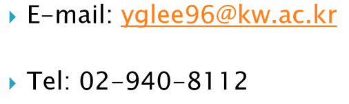
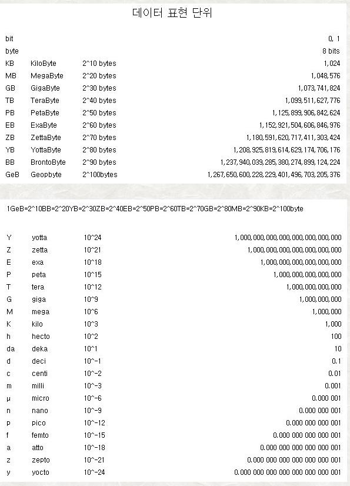

# computerArchitecture
2022-1 Computer Architecture

# 중간 - 컴퓨터구조

복습: No
작성일시: 2022년 3월 1일 오후 2:30

[HUMN 6405 Ethics and Social Justice - Courses](https://annclasshelp.com/course/humn-6405-ethics-and-social-justice/)

- 1주차
    
    # 1주차 22.03.04 금
    
    
    
    강의 자료
    
    **빈칸을 채우는 강의자료**
    
    
    
    **이 강의 처음이라서 문제 유형 정해진 거 없음.**
    
    **설계하는 문제들 나올 수도 있음.**
    
    **약자를 서술하시오 이런 문제는 안나옴**
    
    첫번째 숙제는
    
    내 PC 사양을 조사하기
    
    ### 컴퓨터구조는 왜 배울까?
    
    메모리와 프로세스의 구조를 이해해야 컴퓨터의 성능을 높일 수 있는 프로그램을 만들 수 있어서 입니다.
    
    펌웨어 개발 같은 거 하게 될 때
    
    
    
    컴퓨터 기술에 진보가 많이 이루어졌다.
    
    다양한 어플리케이션에서 사용하고 있다.
    
    
    
    ### 컴퓨터는 3개의 클래스로 나뉜다
    
    - PC(Personal Computer) : 일반적인 목적
    - Server(Server Computers) : 다수의 사용자가 이용할 때
    - Embedded
    
    ### CPU
    
    코어
    
    쓰레드
    
    기본클럭
    
    
    
    임베디드 컴퓨터 시스템
    
    MP3 : 과도한 성능이면 오히려 안 좋음. 전력 소비가 큼.
    
    최대한 저전력으로 음악을 문제없이 플레이할 수 있을 정도로만
    
    
    
    ### Personal Mobile Device
    
    ### Cloud Computing
    
    
    
    메모리 사용량은 신경쓰지 않는 시대.
    
    컴퓨터가 이해할 수 있는 머신 랭귀지로 어떻게 변환되는지, 하드웨어가 기계어를 어떻게 수행하는지 이해해야한다.
    
    소프트웨어 혹은 프로그램의 성능을 무엇이 결정하게 될 것인가?
    
    → 이것을 알게 되면 어떻게 소프트웨어 성능을 향상시킬 것인가를 알게 됨.
    
    성능이 좋아야 하는 프로그램은 자바로 짜면 안됨. 자바는 절대 빨라질 수밖에 없는 구조.
    
    
    
    알고리즘 : 연산량 수, 연산 횟수 줄일 수 있음.
    
    프로그래밍 언어, 컴파일러, 아키텍쳐 : 자바는 캡슐레이션 때문에 연산이 느리다.
    
    프로세서 그리고 메모리 시스템
    
    I/O 시스템 : I/O 디바이스에서 데이터를 빨리 보내줘야 연산을 할 수 있다.
    
    
    
    컴퓨터 시스템 성능을 향상시키기 위해서 시대가 바뀌더라도 계속 적용시킬 수 있는 7개의 아이디어
    
    1. 추상화
    2. 공통 케이스를 빠르게 하자 + - * 등등
    3. 동시에 여러개 
    4. 파이프 라인
    5. 예측을 통해서 성능 빠르게 : 미리 데이터를 고속 메모리에 올려두기
    6. 메모리의 계층 
    7. 중복성을 통한 신뢰성
- 2주차
    
    # 2주차 22/03/11
    
    
    
    실제로 우리 CPU 안쪽에서 하는 일?
    
    ### 어플리케이션 소프트웨어
    
    - 하이 레벨 랭귀지
    
    ### 시스템 소프트웨어
    
    - 컴파일러 : 하이레벨 코드를 머신 코드로 변환한다
    - 운영체제
        - 인풋 아웃풋 핸들링
        - 메모리 저장공간 매니지먼트
        - 스케줄링, 리소스 쉐어링
    
    ### 하드웨어
    
    - 프로세서, 메모리, 입출력컨트롤러
    
    어셈블리로 짜는데 하드웨어 아키텍쳐를 정확히 알지 못하면 C언어로 짠 거보다 못하다
    
    
    
    하이 레벨 랭귀지
    
    - 추상적인 수준으로 구현할 수 있다
    - 생산성과 이식성이 증가
    
    어셈블리 언어
    
    - 
    
    하드웨어
    
    - 바이너리 코드
    
    
    
    ### 유저 인터페이스 디바이스 : 디스플레이, 키보드, 마우스
    
    ### 저장공간 : 하드웨어 CD/DVD, 플래쉬
    
    ### 네트워크 어댑터 : 커뮤니케이션을 위한 다른 컴터들
    
    
    
    키보드와 마우스를 대신하고 있음. 정밀한 대화는 어렵다
    
    저항성과 정전식 타입
    
    
    
    LCD 스크린 : 픽셀
    
    FHD : 1920 * 1080
    
    UHD : 3840 * 2160
    
    여기에 숫자는 픽셀의 숫자를 의미하며, 픽셀은 하나의 색만 보여줄 수 있다.
    
    
    
    아이패드 분해
    
    - A12 CPU : 2개 ARM 코어, 4개의 ARM 코어
    
    
    
    CPU 안쪽
    
    - Datapath : 데이터 경로는 데이터 처리 작업, 레지스터 및 버스를 수행하는 산술 논리 단위 또는 승수와 같은 기능 단위의 모음입니다
    - Control : 데이터 패스를 컨트롤 함
    - Cache Memory : 작지만 빠른 SRAM 메모리를 사용한다. CPU 내에 다른 부품에 대해 접근이 빨라서 속도가 빠름
    
    L1 : 128KB
    
    L2 : 8M
    
    
    
    추상화는 복잡도를 다루기 쉽게 함.
    
    - 로우 레벨의 디테일을 숨긴다.
    
    Instruction set architecture (ISA) : 마이크로프로세서가 인식해서 기능을 이해하고 실행할 수 있는 기게어를 명령어를 말한다.
    
    - 하드웨어와 소프트웨어 사이의 인터페이스
    
    어플리케이션 바이너리 인터페이스
    
    구현
    
    # 시험에서 Instruction set architecture 정도는 알고 있어야 합니다.
    
    
    
    휘발성 메모리
    
    - 파워를 끄면 명령과 데이터를 모두 잃음
    
    비휘발성 메모리
    
    - 마그네틱 디스크
    - 플래쉬 메모리
    - 광학 디스크
    
    
    
    네트워크
    
    
    
    DRAM 용량
    
    
    
    반도체
    
    실리콘에다가 어떤 물질을 섞으면 3가지 기능을 모두 쓸 수 있음
    
    - 컨덕터는 전기가 통하는 것
    - 인슐래이터는 전기가 통하지 않는 것
    - 스위치는 조건에 따라 통하거나 통하지 않는 것
    
    
    
    일드 : wafer 하나 당 정상적으로 돌아가는 비율
    
    
    
    **일드 공식은 외울 필요 없습니다!**
    
    # 우리 수업에서는 Cost per die / Dies per wafer 만 계산할 수 있으면 됩니다.
    
    컴퓨터 살 때 어떤 성능
    
    
    
    Response Time : 일이 있을 때 시간이 얼마나 걸리는지
    
    ThroughPut : 단위시간당 완료된 총 작업 수
    
    프로세스를 더 추가했을 때
    
    
    
    퍼포먼스 자체가  실행 시간의 역수
    
    X가 Y보다 n배 빠르다
    
    
    
    ### 경과 시간 : 측정할 때마다 시간이 달라진다.
    
    CPU가 처리하는 프로세싱, OS 오버헤드, IDLE TIME(어떤 프로그램에 의해서도 사용되지 않는 상태)
    
    ### CPU TIME : 주어진 작업을 실행할 때 소비되는 시간
    
    유저 CPU 타임과 시스템 CPU 타임이 구성한다
    
    
    
    Clock(Cycles)
    
    Clock period 기준 연산을 한번 수행하는 것임.
    
    Data transfer and computation
    
    Update State
    
    클럭은 하나의 단위이고 사이클이다.
    
    Clcok Frequency : 3.2*10^9
    
    Clock Frequency를 역수 취하면 Clock period가 나옴
    
    1초에 32억번 연산을 하는 것임. 32억번의 clock period가 있는 것.
    
    
    
    사이클 갯수 * 사이클의 시간 = CPU TIME
    
    Clock Cycle Time(사이클의 시간)은 = 1/Clock Rate
    
    만약 3M개가 있다면
    
    3M/4G = 0.75 msec
    
    CPU 성능을 높이려면
    
    - 클락 사이클을 줄인다. 어셈블리의 연산 자체를 줄이면 된다
    - 클락 레이트를 높여야 한다.
    - Clock Cycle과 Clock Rate는 Trade OFF 관계. Clock Cycle을 낮추면 Clock Rate도 낮아진다.
    
    
    
    컴퓨터 B를 디자인하려고 한다.
    
    6초만에 이것을 끝내고 싶다.
    
    더 빠른 클락을 살 수 있는데 클락을 빠르게 했더니 사이클이 1.2 clock cycles
    
    
    
    **Clock Cycles = 전체 연산 카운트 * 사이클당 연산**
    
    CPU Time = 전체 연산 카운트 * **CPI(Clock Cycles per instruction) * Clock Cycle Time**
    
    
    
    # 계산식 풀이 해보기
    
    
    
    다른 종류의 클래스에 따라 사이클 갯수가 달라진다.
    
    
    
- 3주차
    
    # 3주차 22/03/18
    
    
    
    ### CPU TIME : 프로그램이 돌아갈 때 CPU가 시간을 얼마나 썼는지?
    
    Seconds/Program갯수
    
    첫번째 인자 : 전체 인스트럭션의 갯수를 프로그램으로 나눈 것 → INSTRUCTION COUNT
    
    두번재 인자 : 클락 사이클을 인스트럭션으로 나눈 것 → CPI
    
    성능에 영향을 주는 요소
    
    세번째 인자 : 시간을 클락 사이클로 나눴기 때문에 클락 → CLOCK CYCLE TIME
    
    1. 알고리즘 : 어떤 알고리즘을 썼느냐에 따라서, 인스트럭션카운트IC에 영향을 줌. CPI도 가능할 수 있다. (CPI가 줄어들려면 동일한 인스트럭션에 클락사이클이 줄어들어야 함)
    2. 프로그래밍 언어 : 프로그래밍 언어에 따라서 IC나 CPI가 영향을 받는다. 하이레벨 랭귀지를 사용하면 더 IC, CPI 증가
    3. 컴파일러 자체는 IC, CPI 영향
    4. 인스트럭션 셋 아키텍쳐에 따라서 IC, CPI, Tc 영향.
    
    
    
    ### 파워
    
    파워를 높여서 성능을 높이는데 한계에 부딪혀서 전력이 유지되고 있음.
    
    파란색 Clock Rate : 1초에 얼마나 많은 사이클을 수행할 수 있는지
    
    3기가 선에서 멈춤
    
    CMOS IC technology
    
    Power = Cpacitive load * Voltage^2 * Frequency(Clock Rate)
    
    만약 5V에서 1V로 전압을 바꾸게 되면 1/25배 만큼 줄어듦
    
    
    
    ### 파워를 줄이기 위해서 어떻게 해야하나?
    
    새로운 CPU를 설계해야함.
    
    과거의 CPU보다 capacitive load 가 85프로 줄어듦 → 전압을 15% 정도  세이브 할 수 있음
    
    전압도 15% 줄어듦. 진동수도 15% 줄어듦.
    
    **0.52 정도 나옴**
    
    구현상에 파워의 한계가 있음
    
    1. 더 이상 전압을 낮추는 건 불가능
    2. 더 이상 열을 제가할 수 없다.
    
    
    
    ### 한개의 프로세스에 대한 성능
    
    전력 문제, 인스트럭션 레벨 문제, 메모리 라텐시(지연시간) 문제
    
    
    
    ### 멀티 프로세서
    
    - 밀티 코어 프로세스
        
        칩에서 한개가 넘는 프로세스를 사용하는 것 → 동일한 면적에 더 많은 코어를 넣을 수 있기에 가능
        
    - 병렬 프로그래밍을 잘해야 한다.
        - 인스트럭션 레벨 여러개
            - 하드웨어에서 여러 개의 인스트럭션을 한번에 수행하는 것.
        - 상당히 어렵다
            - 성능 향상을 위한 프로그래밍 상당히 어렵다
            - 로드 벨런싱 문제
            - 커뮤니케이션과 동기화를 최적화 하는 것 상당히 어려움.
    
    이러한 이유로 코어를 4개를 쓴다고 해서 4배 빨라지는 것이 아님.
    
    
    
    ### 여러개의 프로그램으로 CPU 성능을 평가
    
    - I/O에 관련된 부분은 전부 무시함. CPU 성능에만 초점
    - 레퍼런스 머신을 이용해서 상대속도를 측정하여 일반화
    - 성능의 비율을 지오메트릭 민
    
    성능의 비율을 구하고 비율에 로그끼리의 합
    
    
    
    **파워에 대한 벤치마크**
    
    단일 워크 레벨에 따라서 파워를 얼마나 소비하고 있는지
    
    최종 파워 성능 = 성능 총합 / 와트 총합
    
    
    
    ### 암달스 로우
    
    전체 성능을 향상 시킬 때 향상시킬 수 있는 것과 없는 것을 고려한 것
    
    improvment factor를 아무리 빠르게 해도 T(unafftected)가 크면 의미가 없음.
    
    ### 전체적인 성능 향상시키려면 영향을 받는 부분을 최대한 많이 설정한 후 성능을 개선시켜야 전체적인 성능 향상
    
    EX) 곱셈 전체 100초 중에 80초걸림
    
    이 곱셉을 5배 더 빠르게 했을 때
    
    20 = 80/N + 20
    
    
    
    I7일 경우
    
    100%일 때 258W
    
    ..
    
    구글 데이터 센터는 일반적으로 10~50프로 로드
    
    100%를 활용하는 경우는 전체 시간 중 1%도 걸리지 않음
    
    
    
    ### 조심해야할 것 : 성능의 매트릭으로서 MIPS를 사용하는 것
    
    MIPS : 1초에 얼마나 많은 인스트럭션을 사용하는지(단위 인스트럭션)
    
    밉스 같은 경우
    
    - 컴퓨터에 따라 ISA(인스트럭션 셋 아키텍쳐)가 다르다는 것을 고려하지 않음
    - 인스트럭션 사이에 복잡성 고려하지 않음.
    
    인스트럭션 카운트 / 실행시간 * 10^6 (단위는 밀리언이기 떄문에 10^6으로 나눠줌)
    
    Clock Rate / CPI * 10^6
    
    ## Chapter 2
    
    
    
    - 인스트럭션은 컴퓨터에 명령을 내리기 위한 언어
        
        Set이라고 하면 일종의 어휘라고 보면 됨.
        
    - 컴퓨터 시스템이 다르면 인스트럭션 셋도 다름
        - 하지만, 모든 컴퓨터들이 기본적으로 가지고 있는 연산은 있다
    - 과거에 있는 초기 컴퓨터들은 상당히 단순한 인스터럭션 셋을 가지고 있었다.
        
        최대한 구현을 간단하게 하기 위해서
        
    - 최근 컴퓨터들도 이런 간단한 셋들을 가지고 있다.
    
    우리 수업에서는 이런 일반적인 연산에 대해 주로 공부하겠다.
    
    
    
    ### MIPS 인스터럭션 셋 기준으로 강의가 진행될 것임.
    
    최근에 만든 많은 ISA가 밉스를 따르고 있다.
    
    
    
    모든 컴퓨터의 기본은 Arithmetic 연산을 수행하는 것.
    
    - 덧셈 뺄샘을 어떻게 연산하는지
        - 2개의 소스와 하나의 데스티네이션
        - add a, ,b, c → a gets b + c
    - 모든 산수 연산은 이런 형태를 가지고 있다.
    - 디자인 제1원칙 : **단순하게 함으로서 레귤러(규칙적으로)하게 만든다.**
        - 구현이 훨씬 간단해진다.
        - 저코스트에서 고성능을 내기 위해선 심플하게 만드는 것이 좋다.
    
    # 원칙 물어보는 거 시험에 나올 수도
    
    ‘ex) a b c 말하고 이 원칙이 가지는 장점
    
    
    
    C 코드는 한 줄이지만
    
    MIPS에서는 다음과 같은 코드임.
    
    
    
    우리는 코딩 하면서 변수가 몇개인지 고려하지 않음
    
    하드웨어에서는 많은 변수를 사용하는 것이 불가능함.
    
    오퍼랜드 갯수는 MIPS가 물리적으로 가지고 있는 메모리 크기와 관련이 있다.
    
    물리적인 메모리 == 레지스터
    
    밉스 코드는 오퍼랜드로 사용을 할 때 레지스터 기준으로만 사용할 수 있다.
    
    - 산술 연산은 레지스터 오퍼랜드만 사용할 수 있다.
    - 밉스는 32 * 32Bit(4Bytes) 레지스터 파일을 가지고 있다. (MIPS는 32bits 머신임), 전체가 32개인데 나머지 18개는 어디에 쓰느냐? 함수 아규먼트 이런 것들에 사용하는 레지스터, 코드로 돌아가는 것은 t0~t9, s0~s7 18개, 변수로 쓸 수 있는 것이 18개밖에 안됨.
        - 자주 사용하는 데이터를 레지스터에 넣고 사용 가능
        - 넘버는 0부터 31까지
        - 32비트 데이터이기 때문에 워드라고도 불림
    - 어셈블러에서의 명명
        - t1 ~ t9 temporary values
        - s1 ~ s7 saved variables 자주 사용하는 변수
    - 디자인 제2원칙 : **작은 것 일수록 더 빠르다**
        - CPU에 연결이 다 되어 있어야 하는데 메모리가 많을 수록 딜레이가 심해지기 때문에 느려진다.
        - 속도가 빠르게 하려면 갯수를 줄여야 한다.
    
    메인 메모리는 많기 때문에 속도가 느리다.
    
    
    
    
    
    - 메인 메모리에 저장되어 있는 데이터 어떻게 사용할 것인가? : array, 구조체, dynamic data
    - 산술 연산에 적용하기 위해선
        - Load 메모리로부터 레지스터로 로드해야한다.
        - Store 레지스터에 있는 결과를 메모리에 저장해야한다.
    - 메모리는 바이트로 어드레스 되어 있고
        - 각각의 어드레스는 8비트로 구성이 되어있다. 1바이트임
    - Words = 4Bytes (워드 단위 데이터 어세스)
        - 워드의 어드레스는 4의 배수이다.
    - MIPS는 빅인디언이다.
        - 가장 큰 값(Most-significant bytes)를 가장 작은 주소(Least address)에 넣음.
        - 리틀인디언은 가장 작은 값을 가장 큰 주소에 넣음.
    
    
    
    컴파일 MIPS 코드
    
    배열이기 때문에 A[8]이라면 A의 시작 주소로부터 32만큼 떨어져 있는 것임(1 word = 4 Bytes)
    
    `lw $t0, 32($s3)` # load word → s3로부터 32 offset 만큼 떨어진 곳에 접근하여 로드한 값을 t0에 저장.
    
    이후 s1에 저장
    
    
    
    이번엔 저장을 A[12]에다가 함.
    
    `sw $t0, 48($s3)` t0에 있는 값을 48($s3)에 저장.
    
    # 주의 sw는 dest, source가 아님 뒤에가 dest임
    
    바로 저장되지 않음! 실제로 저장되는 시간은 저 사이에 더 걸릴 수 있다.
    
- 4주차
    
    # 4주차 22/03/25
    
    ### 어렵지 않은 문제로 약간의 숙제 낼 것임
    
    ### 챕터3는 실제로 하드웨어 구조 기본 연산
    
    가장 유명하고 심플한 아키텍쳐인 MIPS를 기반으로 하기 때문에 이것을 배워두면 다른 것들도 이해하기 쉬움.
    
    ### MIPS Simulator
    
    [WeMips: Online Mips Emulator](https://rivoire.cs.sonoma.edu/cs351/wemips/)
    
    
    
    ### 레지스터와 메모리의 차이
    
    # 개념적으로 중요!!!!
    
    - 레지스터가 메모리보다 접근이 빠르다.
    - 메모리 데이터 작업은 로드와 스토어를 요구한다.
    - 컴파일은 무조건 사용한다 레지서를 변수로 가능한 만큼
    
    lw는 word 단위로 로드
    
    sw는 word 단위로 세이브
    
    
    
    C코드
    
    입력으로 들어간 데이터를 출력으로 사용할 수 있다.
    
    immediate instruction은 별도로 없다.
    
    전체적으로 속도를 빠르게 한다.
    
    ### 상수가 오퍼랜드인 경우 addi를 사용한다!
    
    디자인 제3원칙 : 커먼케이스를 빠르게 한다.
    
    
    
    0이라는 값을 가지고 있는 레지스터를 지원한다.
    
    여기에는 항상 0이 들어가있다.
    
    이 값은 오버라이트 되지 않는다.
    
    ### MOV 대신 ADD와 ZERO를 사용한다
    
    s1에 zero를 더하는 건 값이 변하지 않기 때문에 s1에 값이 t2에 저장된다. 이것은 MOV와 동일한 역할
    
    ### 5주차 퀴즈 볼 예정
    
    
    
    ### 표현할 수 있는 범위 : -2^n-1 ~ -2^n-1 -1
    
    
    
    32비트 기준으로 0~31개 비트가 있는데
    
    최상위 비트인 31비트를
    
    - 1일 때는 음수
    - 0일 때는 양수
    
    **인버팅을 하고 1을 더해주면 음수값을 표현할 수 있다.**
    
    
    
    Sign Extension
    
    - addi : 32비트보다 작은 값을 로드함.
    
    
    
    양수인 경우에는 0을 늘려주고, 음수일 경우에는 1을 늘려주는데 이때는 어떤 걸 늘려야할지 어떻게 판단할까?
    
    ### → 마지막 비트인 sign 비트를 그대로 늘려주면 됨.
    
    
    
    - 인스트럭션 32비트 자체로 인코딩이 된다.
    - temp 레지스터가 10개가 사용되고 있고
    - save 레지스터는  8개가 사용되고 있다.
    
    # 각 레지스터의 레지스터 넘버를 물어보는 문제는 내지 않을 것.
    
    
    
    CPU에서 어떻게 프로그램을 읽을 것인가?
    
    **모든 인스트럭션 자체가 32비트로 구성되어 있다.**
    
    - op : operation code 6비트
    - rs : first source register
    - rt : second source register
    - rd : destination register
    
    rs rt rd가 5비트인 이유는 32를 표현해야하기 때문에
    
    - shamt : shift amount → 5bit 넘어갈 일 없기 때문에
    - funct : function code (extends opcode) 6bit opcode 확장시 사용
    
    # op코드나 funct 코드를 다 외우게 시키진 않음.
    
    
    
    
    
    # ~~시험을 위해서 레지스터 넘버 외워야 해요~~
    
    # op와 funct는 외울 필요 없음.
    
    # add 를 보고 R-format을 채우거나? R-format을 보고 add를 쓰거나
    
    
    
    ### MIPS I-FORMAT
    
    - rt : destination과 source
    - constant : 상수
    - address : 상수 대신 주소값을 가질 수도 있음.
    
    **디자인 제4원칙 : 좋은 디자인은 좋은 타협을 한다.**
    
    → 인스트럭션 자체를 32비트로 유지를 하겠다.
    
    ㅍ→ 포멧을 최대한 유지해줘야한다.
    
    → 앞에 op rs rt 부분은 똑같고 뒤에 부분만 다르게 나눠져 있음.
    
    # R-format, I-format 형태 안줄 것임. 몇 비트인지 외워야 함.
    
    
    
    
    
    - 인스트럭션도 바이너리 형태로 표현되어있다.
    - 컴파일로 조차도 메모리로 되어있을 수 있다.
    
    
    
    
    
    ### 쉬프트 연산
    
    - 얼마나 많은 위치를 연산하는지 shamt 5비트에 넣어준다.
    - Shift left logical
        - 0을 채워넣는다.
        - 2를 곱하는 것과 동일함.
    - Shift right logical
        - 0을 채워넣는다.
        - 2를 나누는 것과 동일함.
    
    
    
    mask 비트를 하는데 유용하다
    
    
    
    원래 있는 값이 모든 상관 안하고 1로 바꿀 때 유용하다.
    
    
    
    ### MIPS에서는 NOT을 제공하지 않는다.
    
    nor $t0, $t1, $zero
    
    1. a or 0 → a가 나옴
    2. 이후 not이기 때문에 ~a가 나옴
    
    
    
    # ADD SUB 이런 키워드는 제시를 할까 생각중 결국 다 알아야 함.
    
    조건으로 나누어지기 때문에 가지라고 보고. 이것을 branch라고 함.
    
    조건문
    
    - beq : rs rt가 같다면 L1 레이블로 점프를 해서 가는 것. 조건을 만족하지 않는다면 그냥 다음 인스트럭션 실행
    - bne : 같지 않다면 L1 레이블로 점프함. 조건 만족 안 하면 다음줄 실행
    - j : 그냥 jump하는 것임.
    
    while이나 for문을 어셈블리에서 제공하지 않음.
    
    
    
    1. 같지 않으면 ELSE로 간다.
    2. 만약 같다면 다음 라인인 ADD가 수행되고
    3. JUMP로 EXIT가 수행된다.
    
    # 이걸 다음주 퀴즈에 낼 수도 있음.
    
    # 해당 C코드를 보고 MIPS로 옮기거나, MIPS를 보고 C코드로 옮기거나 할 줄 알아야 함.
    
    
    
    1. 베이스 어드레스에 $S6 + i*4를 해야하기 때문에 쉬프트 연산을 해야한다. 2^2이기 때문에 2비트 쉬프트 해서 t1에 넣음(i라는 원본을 유지하기 위해 $t1 변수에 넣음)
    2. t1과 s6를 더해서 t1에다가 저장 → save[i]를 가져옴.
    3. t0에다가 save[i] 값을 로드
    4. t0와 s5를 비교함 같지 않으면 Exit << 이 루프를 끝내야 함.
    5. 1을 더 해준다
    6. Loop를 통해서 원래로 돌아간다.
    
    
    
    인스트럭션들이 쭉 나열된 블럭
    
    - 브랜치가 포함되어있지 않아야 한다.(끝날 때 브랜치가 있을 수도 있음)
    
    컴파일러가 베이직 블럭을 모아서 해석을 함.
    
    
    
    - 어떤 조건을 만족하면 1을 설정 아니라면 0
    - beq와 bne를 같이 쓰면 ≤ ≥ 으로 가능
    
    
    
    blt, bge 이런 것들 왜 없냐?
    
    하드웨어적으로 <, ≥ 이런 것들은 =랑, =/ 보다 훨씬 느리다.
    
    **어떤 특정한 연산으로 인해 연산 속도가 느려질 수 있음.**
    
    beq bne가 커먼한 케이스이다.
    
    
    
    signed 일때와 unsigned 일 때 u가 붙느냐 안 붙느냐에 차이
    
    **사인이냐 언사인이냐에 따라서 값이 다르게 나옴.**
    
    
    
    ### 함수 호출에 대한 이야기
    
    기계어 관점에서 프로그램 코드들이 하나도 바뀌지 않은 상태
    
    1. 레지스터에 대한 파라미터들
    2. 함수로 컨트롤을 이동
    3. 함수를 위해서 스토리지를 얻아.
    4. 함수를 수행
    5. 결과를 저장해두고
    6. 리턴
    
    
    
    save는 복구를 해줘야하지만 temp는 그냥 쓰면 된다.
    
    32개의 레지스터가 있는데 연산을 쓸 수 있는 건 상당히 제한적임
    
    
    
    - Jump and link
        - 되돌아갈 어드레스는 저장해야한다. 돌아갈 어드레스 ra를 넣는 것까지 포함하는 것.
        - 타겟주소로 점프를 한다.
    - 레지스터 점프 : 되돌아간다.
    
    
    
    ### Leaf Procedure
    
    4개의 아규먼트를 받고 있다.
    
    $s0라는 레지스터가 파괴되지 않기 위해서 stack에 저장한다.
    
    나중에 s0를 쓰다가 s0를 다시 되돌려놓음.
    
    
    
    addi = sp sp -4는 메모리를 한칸 더 밑으로 이동하여 메모리를 할당받는 것임
    
    1. s0를 스택에 저장함.
    2. 프로세듀어 바디
    
    
    
    - 함수에서 함수를 부르기 때문에 함수 내에 Argument 부분도 생각해줘야함.
    - ra도 저장을 해줘야한다
    
    # 강의 자료 오타임 return f가 아니라 return 1임
    
    
    
    1. ra와 a0를 스택에 저장해야한다.(후에 a0와 ra를 복구해준다 )
    
    # 이거 순서 중요함 ra a0먼저 저장했으면 로드는 a0 ra 순으로 해줘야 함.
    
    1. t1이 작다면 zero라면 false 라면 L1으로 가는 것.
    2. v0값에 1을 저장.
    3. 스택만 정상으로 되돌려줌. ra와 a0를 사용하지 않았기 때문에.
    4. L1으로 갔을 때 == else로 갔을 때
    5. a0 값을 -1 줄여줌.
    6. 그리고 함수 호출을 함.
    7. 함수 호출이 끝나면 원래 값을 되돌려준다.
    8. 리턴값과 a0(n) 값을 곱해주고 이것을 v0에 저장.
    9. jr $ra << 리턴
    
    # 구조화된 생각을 해야한다. 페어를 잘 생각해야함.
    
    # 블럭 단위로 생각을 잘해야 함.
    
    
    
    메모리 관점에서 살펴보면?
    
    로컬 변수로 역으로 되돌리지 않고 fp부터 stack을 복구 해주는 기법 << 이것은 컴파일마다 다르다.
    
    수업 범위 밖의 내용임.
    
    
    
    메모리 레이아웃
    
    전체 구간을 나눠서 사용하고 있음. 메모리가 미리 꽉차있지 않을 수 있음.
    
    - 영역이 나뉘어져있고 stack은 위부터 내려가서면서 쓴다
    - 동적 데이터 영역은 밑에서 위로 가면서 쓴다.
    
    
    
    
    
    - lb : offset 만큼 떨어진 곳에서 1바이트로 읽는 것
    - lh : offset 만큼 떨어진 곳에서 2바이트(halfword == 4/2) 읽는 것.
    - sb는 rt에 저장.
    
    # lb와 lbu의 차이를 써라.
    
    lb는 sign 데이터 lbu는 unsigned 데이터 일 때 사용한다.
    
    1바이트를 가져오는데  32비트짜리 레지스터에 가져오기 때문에 나머지 24비트에 어떻게 채워줄 것인지 결정해야해서.
    
- 5주차
    
    # 5주차 22/04/01
    
    
    
    입력하게 들어온 x를 y로 복사하는 것.
    
    while 문에서 x[i] = y[i] 대입하다가 널문자 나오면 종료.
    
    가정
    
    - x와 y에 있는 데이터 베이스 어드레스는 a0, a1
    - i는 s0에 저장한다고 가정
    
    
    
    1. 스트링 카피 함수 시작
    2. 스택에 공간 하나 마련 → i를 저장하기 위해, -4인 이유, stack 공간이기 떄문에 주소값이 증가하는 방향이라서 -4만큼 내려감.
    3. save 변수 값을 sp에 백업
    4. i값을 0으로 초기화 시켜줌. 2개의 0을 더해서 s0에 초기화
    5. L1 함수 시작
    6. t1에 값에 a1 + s0 즉 y[i] 주소값을 저장
    7. t1값을 t2에 로드. t2에는 한글자가 담겨야함. lbu 사용. 한글자 bytes / unsigned 익스텐션
    8. t3에 a0 + s0 즉 x[i] 주소값을 저장
    9. sb를 사용하여 t2에 로드한 y[i]를 t3, x[i]에 저장. 주의!! sb t2, t3임 #x[i] = y[i], t3 = t2
    10. beq t2, zero, L2 #null이라면 L2로 가서 종료
    11. 아니라면 인덱스 1 증가 시키고
    12. L1으로 점프
    13. L2에서 다시 s0에 sp값 로드
    14. 4만큼 주소값 감소 4를 더해줌.
    15. jump register : ra → return address 호출지점 + 4
    
    
    
    - 상수 값들은 작은 것들이 일반적임.
        - 16비트는 충분한 게 일반적
    - 32비트를 필요로 하는 경우
        - 추가적인 연산을 지원 **lui : load upper immediate, ori : or immediate**
        - lui rt, constant
        - copies 16 bit-constant to left 16 bits of rt : 레프트 방향으로 16비트 만큼 로드를 함.
        - 예제1) lui사용. 61이란 값을 좌측에 로드하는 것이 아니라 우측에 로드함.
        - 나머지 우측에 데이터를 채울 때는 ori를 사용하여 s0에 데이터를 채움.
    
    
    
    ### 브랜치 어드레싱
    
    - 브랜치 어드레싱 : op코드, 2개의 레지스터, 타겟 어드레스(어디로 움직일지)
    - 일반적으로 이런 브랜치들은 다켓 어드레스가 실제로 브랜치가 발생하는 곳 근처.
        - 16비트 어드레스로 충분하다. 2^16 = 32 * 1000
        - 실제 어드레싱이 아니라 PC-relative addressing 을 사용.
        - 현재 PC(프로그램카운터, 브랜치가 발생한 곳) + offset * 4 (주소 자체가 4의 배수로 구성되어 있다)
        - 인스트럭션 하나는 32비트 즉 4바이트로 구성
        - **PC는 이미 4만큼 증가가 되어있는 상태 !! 주의하기. 다음에 해당하는 것을 가르키고 있음.**
        
        
        
    
    
    
    텍스트 세그멘트에 있는 어떤 위치로도 이동할 수 있다.
    
    - 풀 어드레스(절대주소) 인코딩
    
    다이렉트 점프 어드레싱
    
    - 타켓 어드레스 : address * 4 해서 만들어냄.
    
    PC31~28 : 4비트
    
    Address * 4 : 26 + 2(**4배가 커져서 2비트 증가**) = 28비트
    
    합쳐서 32바이트
    
    
    
    - sll 인스트럭션 80000
    - bne에서 Exit 브랜치의 주소는 2임
        - 80012+4(하나증가) + (2*4)주소값 = 80024
    - j Loop 20000은 절대 주소라서 20000*4 = 80000
    
    
    
    - 경우에 따라서 브랜치 타겟이 16비트 오프셋보다 엄청 떨어져 있을 때 어떻게 할 것인가?
    - L1이 상당히 멀리 있을 경우
    1. beq $s0, $s1, L1이라면 여기서 L1 주소값을 16비트로만 표현할 수 있음
    2. 이것을 bne $s0, $s1, L2로 바꾸고 + j L1으로 바꾸면 L1에 들어갈 수 있는 주소값은 26비트 실제론 28비트이기 때문에 상당히 멀리 있는 곳까지 가르킬 수 있다.
    
    
    
    ### 전체적인 어드레스 모드를 요약
    
    1. 이미디어트 어드레싱 : 이 값을 그대로 사용하는 법
    2. 레지스터 어드레싱 : 주소에 대한 내용이 레지스터에 저장되어 있고, 인스트럭션에서 레지스터 주소값을 가르킴
    3. 베이스 어드레싱 : 인스트럭션 주소값 * 레지스터에 저장된 주소값 연산해서 최종 어드레스 계산
    4. PC 기반 어드레싱 : PC에 있는 주소를 가져오고 인스트럭션 어드레스를 이용해서 메모리상 주소 계산.
    5. Pseudodirect addressing : 큰 어드레스를 가져오거나 멀리 있는 걸 접근하거나 할 수 있는 방법.
    
    
    
    다소 내용이 어려울 수 있음.
    
    - 두 개의 프로세스가 서로 하나의 메모리를 공유할 때
        - 동시에 같은 데이터를 쓰고 읽을 때
        - 2개의 프로세스가 독립적으로 일을 하게 되면 결과가 달라질 수 있다.
    - 하드웨어의 지원이 없다면 구현 자체가 어려울 수 있음.
        - 메모리 오퍼레이션을 할 때 아토믹한 형태로 동작해야한다. 읽고/쓰는 경우 중간에 다른 프로세스가 개입되지 않고 동작해야한다.
        - 리드와 라이트 사이에 다른 프로세스가 개입하지 못하게 해야한다.
    - 싱글 인스트럭션
        - 아토믹 페어를 이용해서 구현을 한다.
    
    
    
    load link : ll rt, offset(rs) : 오프셋 만큼 rt에 읽음
    
    store conditional sc rt, offset(rs) : 오프셋 만큼 rt에 저장
    
    - 정상적으로 저장했으면 1이라는 값을 리턴한다.
    - 저장에 실패하면 0이라는 값을 리턴한다.
    
    **load link와 store conditional 사이에 rs 주소값을 누군가 접근해서 바꿔질 수도 있음. 이것이 race 프로그램.**
    
    **원래 있는 값이 유지되도록 하는 것이 싱크로나이제이션**
    
    → 변하지 않았다면 1, 변했다면 0
    
    예제)
    
    1. ~~s4에 있는 데이터 t0으로 이동~~
    2. load linked를 통해서 s1에 있는 값을 t0에 읽어옴
    3. addi 를 통해 t0에 1을 증가시킴
    4. t0에 있는 값을 s1에 다시 저장을 함.(s1값이 변화가 없었다면 제대로 저장되고 t0에 1이 저장될 것임)
    5. t0와 0을 다시 비교해서 같다면 다시 try 위치로 이동.
    
    # Translation and Stratup 그냥 넘어감
    
    
    
    - 대부분의 머신 인스트럭션과 어셈블러 인스트럭션은 1대1 매핑 관계를 가진다.
    - move를 쓰더라도 add zero로 매핑할 수 있음
    - blt 가 없지만 slt, bne로 쪼갤 수 있음.
    - 슈도 인스트럭션
    
    # 위 부분 생략
    
    # ~ C Sort Example까지 전부 생략
    
    
    
    C 버블 소트 코드 어셈블리로 변환.
    
    k와 k+1 값을 서로 바꾸는 함수
    
    - v는 $a0, k는 $a1, temp는 $t0
    
    
    
    1. k번째 엘리먼트 저장하기. t1에 k*4값 저장 후 t1에 v + (k+4) 값 저장.
    2. v[k]의 주소값이 t1에 저장되어 있음
    3. temp(t0)에 v[k] 값 로드
    4. t2에는 v[k+1] 값 로드
    5. v[k+1] 값을 v[k]에 저장
    6. temp에 있는 값을 v[k+1]에 저장
    7. jr ra로 리턴
    
    
    
    ### 스왑을 이용하여 소팅하는 법
    
    v라는 어레이를 받고 n개의 엘리먼트를 소팅함.
    
    1. 첫번째 for문으로 전체를 순회
    2. 두번째 for문으로 비교, 인덱스 하나 작은 것 j로 시작해서 j가 0보다 크고, v[j] > v[j+1] 이전 것이 더 크다면 swap 실행
    
    v : $a0, n : $a1, i $s0, j : $s1
    
    
    
    1. a0에 있는 값 s2에 저장
    2. a1에 있는 값 s3에 저장
    3. s0레지스터 0으로 #i 값을 0으로 초기화
    4. slt $t, $s0, $s3, s3가 s0보다 클 때 1로 셋팅 됨. **n이 i보다 클 때 1로 셋팅**  #i가 n보다 작을 때 코드가 돌아감.
    5. 만약 t0가 0이라면 exit1로 나가게 됨. i < n 조건에 위배
    6. j = i - 1을 하기 때문에 addi 로 -1 해줌 s1 = s0 - 1
    7. for2tst : j를 중심으로 도는 for문
    8. j가 0보다 크거나 같을 때 for문이 돌아야 함.(조건 하나 더 있긴 함) s1(j가)이 0보다 작은지 확인, **j가 0보다 작다면 t1에 1을 대입**
    9. t0가 0인라면, 즉 s1 < 0 (j < 0)이라면 exit2로 for문 탈출
    10. 다음 조건인 v[j] > v[j+1] 검사,
    11. t1 = j * 4 # j 인덱스
    12. t2 = s2 + t1 # v + (j*4), v[j]의 주소값
    13. t3에 v[j] 로드
    14. t4에 v[j+1] 로드
    15. t4와 t3를 slt를 비교함 v[j+1] < v[j]이라면 1이 저장, 즉 t4 ≥ t3라면 0이 저장됨
    16. 만약 0이라면 exit2로 for문 탈출
    17. s2(v[])값을 a0에 넣어주고, s1에 업데이트 된 j값을 a1에 넣어줌.
    18. jal swap 함수 호출
    19. 두번째 for문 증감식 addi s1, s1, -1 : j -= 1
    20. jump하여 for2tst로 돌아감
    21. 첫번째 for문 증감식 addi s0, s0, 1 : i += 1
    22. jump하여 for1tst로 돌아감.
    
    
    
    이전 슬라이드에 있는 부분이 procedure body 부분
    
    sort 함수 시작하면
    
    20 바이트에 대해서, 총 5개의 레지스터를 저장할 수 있는 데이터 할당
    
    1. ra값 저장 : 함수 호출시 사라질 수 있기 때문에
    2. **save값 4개 저장함. 순서 s3 → s0**
    3. exit1에 대해서 처리를 함. 더 이상의 코드가 없기 때문에 함수가 종료.
    4. 스택에 있는 값들을 되돌림.
    5. **save값 4개 로드. 순서 s0 → s3**
    6. 그런 다음에 리턴된 어드레스 ra 값 복구
    7. 스택 포인터 공간 5개 원래대로 되돌려 줌. +20
    8. jr $ra, 전체 코드가 종료가 됨.
    
    MIPS 코드 작성법 팁
    
    1. 코어에 대해서 작성
    2. 세이브, 로드하는 코드 작성
    
    
    
    ### 컴파일러를 이용한 최적화 결과 (gcc 컴파일러)
    
    최적화를 안했을 때 1로 잡은 것.
    
    O1, O2, O3
    
    - O3가 가장 큼
    - O1이 작음
    - O1~O3 비슷함
    - CPI O1이 가장 큼
    
    
    
    언어와 알고리즘에 따라서 어떻게 차이가 나는지
    
    
    
    - 인스트럭션의 갯수 CPI 값은 성능을 평가하기에 좋은 지표는 아니다. 모든 것을 같이 생각해야함
    - 컴파일러가 최적화를 하는데, 알고리즘에 예민하다.
    - Java/JIT 컴파일된 코드는 성능향상에 훨씬 더 빠르다.
    - **가장 중요한 것은 알고리즘이 좋아야 한다.**
    
    
    
    ### 어레이를 이용하는 경우와 포인터를 이용하는 경우 차이
    
    - Array를 통해 인덱싱을 하면
        - 인덱스와 엘리먼트 사이즈를 곱합 i * 4
        - 베이스 어드레스를 더함 a + (i * 4)
    - 포인터를 쓰면 메모리에 직접 접근 가능
        - 인덱싱 복잡성을 피할 수 있다.
    
    
    
    ### 사이즈 크기만큼 0을 셋팅하는 코드
    
    오른쪽에서 t2는 배열 끝 부분의 엘리멘트의 주소값임 array[size]
    
    
    
    ### 어레이와 포인터 비교
    
    - 어드레스를 계산하기 위해서 shift를 통해 4를 곱해주고, 주소값 덧셈에 대한 부분에 대해 이득
    - 컴파일러가 다음과 같은 역할 : 인덕션 변수 제거, 더 나은 명확하고 안전한 프로그램 만들 수 있다.
    
- 6주차
    
    # 6주차 22/04/08
    
    ## 시험정보
    
    밉스 인스트럭션 있냐 없냐 이런 것들 문제안낼 것임.
    
    수업에서 다루는 인스트럭션만 기준을 삼음.
    
    첫번째 시험이어서 
    
    디자인 프린시플을 다써라 라는 문제는 안낼것이지만, 
    
    
    
    # 이런 것은 내지 않을 것임. 숫자 암기 안시킴
    
    ARM V8 인스트럭션 이런 것도 외울 필요까진 없을 듯.
    
    
    
    **~~끝까지 참고만 하면 될 거 같아요**
    
    
    
    시험에서 어떤 정보를 주느냐? 인스트럭션 이름 정도 줄 것임.
    
    
    
    - 인티저에서 오퍼레이션을 수행함
        - 덧셈 뺄셈
        - 곱셉 나누셈
        - 오버플로우를 다룸
    - 플로팅 포인트 실수
        - 표현과 연산하는 법
    
    
    
    **7+6 연산하고 캐리가 올라가는 구조.**
    
    000111 + 000110 = 
    
    만약 32비트 + 32비트 연산이라면 33비트까지 표현될 수 있는데 이때 오버플로우가 발생
    
    - 양수랑 음수를 더하면 무조건 오버플로우 발생하지 않음.
    - 양수 2개 더할 때 오버플로우 발생. result sign이 1일 때
        - **sign 비트 0이면 양수**
        - EX) 4비트로 표현할 때 가장 큰 수 : 7, 0111 (최상위 비트 1개는 sign 비트임)
            - 오버플로우가 발생했을 때 sign 비트는 1이 됨.
        - sign 비트가 1이 나온 것은 잘못 나온 것이기에 오버플로우 발생
    - 음수 2개 더할 때 오버플로우 발생.
        - 오버플로우시 sign 비트가 0으로 나오는 현상 발생
    
    # sign 비트 찾아보기
    
    
    
    뺄셈은 덧셈으로 바꾸어서 처리를 함. → **뺄샘을 위한 하드웨어는 존재하지 않는다.**
    
    +7과 6의 2의 보수를 덧셈
    
    오버플로우가 언제 발생하느냐?
    
    - 두개의 부호가 같은 부호일 때는 오버플로우가 절대 발생하지 않음. **같은 부호의 뺄샘**
    - 서로 다른 부호를 빼줬을 때 오버플로우 발생
        - 양수에서 음수를 빼주면 양수(sign 0)
        - 음수에서 양수를 빼주면 음수(sign 1)
    
    
    
    - C언어 같은 경우 오버플로우를 무시한다.
        - MIPS addu, addui, subu 같은 것들은 오버플로우 무시
    - Ada, Fortran 같은 언어에서오버플로우가 발생하면 EXCEPTION이 발생
        - 잘 안쓰는 거라 그냥 넘어감
    
    
    
    멀티미디어를 위한 연산
    
    - 그래픽이나 미디어 프로세싱을 할 대 벡터로 처리를 한다.
        - 언사인드를 쓴다고해서 속도가 빨라지지 않는다.
        - 무조건 32비트라고 생각하고 연산하기 때문
        - 그런데 멀티 미디어 데이터는 8비트인 경우가 많음. 8비트의 데이터가 32비트에 담기는 경우가 생겨버림.
        - SIMD(single-instruction, multiple-data), 4개를 묶어서 동시에 더 해버린다. 오버플로우를 막기 위한 특별한 하드웨어가 들어감.
        - 최근 64비트 덧셈을 사용하는데  8비트짜리 데이터 8개를 동시에 로드하고 더하고 세이브할 수 있음.
        - 이를 사용하면 8배나 더 빨리짐.
        - 8*8, 4*16, 2*32 비트
    - 스터레이팅 오퍼레이션
        - 오버플로우를 막아주는 개념?
        - 0~255인데 200 + 200 = 400이고 오버플로우가 되는데 이걸 버리면 145 << 200보다 더 어두워짐
        - 영상이란 분야에서는 200 + 200 = 255로 표현함.
    
    
    
    ### 곱셈
    
    사람이 생각하는대로 접근을 해보자
    
    1000와 1001를 곱함.
    
    1000 + 00000 + 000000 + 1000000 = 1001000
    
    결과물의 길이를 입력데이터를 보고 예측할 수 있음.
    
    
    
    1. 1000 * 1
    2. 1000 * 00 = 10000 * 0
    3. 1000 * 000 = 100000 * 0 
    4. 1000 * 1000 = 1000000 * 1
    
    모든 것을 다 더하면 → 1001000
    
    **진짜 연산**
    
    1. Multiplicand Shift left에 1000이 들어감
    2. Multiplier Shift right에 1001이 들어감.
    3. Multiplier 맨 끝에 있는 1이 Control test로 나감
    4. 64-bit ALU에서 Multiplicand와 Control test를 연산.
    5. **다음 연산에서는 1000이 shift left 연산으로 10000이 되고, 1001은 shift right 연산으로 100이됨.**
    6. 3번부터 다시 반복
    
    **64비트 ALU 연산인 이유**
    
    1. Multiplicand에서 32비트 값을 shift 연산하면 63비트까지
    2. 계속 데이터가 더해지면 63비트가 될 것이고 이것들이 더해지면 최대 64비트가 됨.
    
    **순서도**
    
    1. test multiplier 값 체킹
    2. 1이라면 연산 후 더함, 이후 쉬프트 연산
    3. 0이이라면 연산 없이 쉬프트 연산
    4. 마지막 비트가 아니라면 다시 돌아감.
    
    덧셈은 32비트 연산인데, 64비트 연산을 씀.
    
    ALU가 64배나 복잡. 덧셈 한번 할 때 곱셈이 얼마나 느릴지?
    
    
    
    ### 좀 더 빠른 방법 : 최적화 Multiplier
    
    - 32-bit ALU를 사용하자
    - Multiplicand에 1000
    - Control Test에 1001
    - 기준선에 맞춰서 필요한 만큼만 덧셈해서 처리하자.
    - 이렇게 해서 연산 속도를 높임.
    - right 방향으로 쉬프트 하는 이유. 밑 그림에서 1001에 100만 더 할 수 있도록
    
    
    
    
    
    
    
    ### Faster Multiplier
    
    Adder를 여러개 써서 속도를 빠르게한다
    
    내부적인 자세한 로직은 몰라도 됨!
    
    개념만 → 묶어서 더해나감
    
    → 5스택으로 처리가능
    
    Adder가 31개가 들어감
    
    
    
    ### MIPS 인스트럭션 관점에서 곱
    
    32비트 *  32비트 = 64비트가 나옴.
    
    밉스에서는 64비트를 한 레지스터에 저장할 수 없기 때문에 HI, LO에 저장한다.
    
    # 우리 수업에서는 교재 기준으로 진행. 멀티가 밉스마다 다름.
    
    
    
    ### 나눗셈
    
    1. 큰 숫자를 나눌 것.
    2. 만약 나누는 수보다 크다면? 1를 곱해서 앞자리에서 뺌
    3. 나머지가 1이 나옴.
    4. 뺄지 말지 보고 못 뺀다면 0을 붙여줌. 그리고 몫에는 0을 붙여나감
    5. 한자리 한자리 계속 빌려와서 나눌 수 있을 떄까지
    6. 1010은 나눌 수 있기에 1000으로 나누고 10
    
    
    
     Divisor에 1000 들어가고 Reminder 초기값이 1001010, 목은 Quotient
    
    1. Divisor을 반으로 나눠서 큰값이 쉬프트 해서 들어감.
    2. Reminder값 ALU 왼쪽으로 들어감
    3. Reminder값 비교해서 0보다 크다면? 몫에다가 1 셋팅 → 마지막 비트 아니라면 다시 반복
    4. Reminder값 비교해서 0보다 작다면? 오지지날 벨류를 되돌림.
    5. 양수인지 음수인지 판단을 해서 Quotient 설정
    
    # 어떻게 돌아가는지 알고 있어야 함
    
    - 처음에 몫부분이 32비트로 초기화 되어있음 → 1000 0000 0000 0000 .... 0000 << 32비트
    - 근데 shift right 연산으로 하면서 계속 비트를 줄여나가다가
    
    
    
    - 쉬프트 right, left 다 있어야 함. 번복하는 개념 때문에
    
    # 이 슬라이드는 시험에 내지 않을 것임.
    
    
    
    생략을 할게요.
    
    
    
    ### MIPS 나눗셈 연산
    
    나머지와 몫이 있음.
    
    - HI : 32비트 나머지
    - LO : 32비트 몫
    
    오버플로우나 0으로 나누는 것에 대한 체크는 하지 않음.
    
    코드에서 체크해야함.
    
    mfhi, mflo 사용해야 결과 접근
    
    
    
    Floating Point normalized 정규화
    
    - 값이 1자리어야 하며
    - 0이 아닌 수여야함
    
    바이너리 형태는 이렇게 되어있어야 함.
    
    
    
    # 참고로 읽어보세요
    
    
    
    ### 플로팅 포인트 포멧
    
    - sign 비트는 1비트
    - Exponent : 8비트
    - Fraction : 23비트
    - x = (-1)^s * (1+Fraction)* 2^(exponent - bias)
    - s가 0이면 양수, 1이면 음수
    - normalize 가정하고 있음.significand는 1와 2사이
    - Bias 127임. 만약 0이면 0-127이 됨
    - double일 때는 소수점에 대한 유효숫자가 커진다
    
    
    
    ### Single precision의 계산법
    
    - 00000000 11111111 사용하지 않는다.
    - 1 - 127 = -126
    - 헷갈릴 수도 있는 것, 10^-126이 아님! 2^-126승임
    - 2^-10은 10^-3 정도 됨.
    
    예약된 값 빼고 가장 큰 값
    
    - 11111110 이 가장 큼
    - exponent 254 - 127 = 127
    - fraction은 전부 1인 것이 가장 큼 2.0에 근사함
    - 2.0 * 2^127 = 3.4 * 10^38
    
    
    
    ### double precision의 계산법
    
    - 앞에 single과 동일하다.
    - 제일 작은 값은 exponent 0000...1인것, fraction 0000000인것
    - expontent - bias = -1022
    - 제일 큰 값은 2046 - 1023 = 1023
    - faction 2에 근사함
    
    ㅁ
    
- 7주차
    
    # 7주차 22.04.15
    
    
    
    **상대적인 프리시젼**
    
    싱글 프리시젼 s / exponential / fraction
    
    [floating type 사용 시 주의할 점. single/double precision. 메모리 표현 방식. floating type 이야기 [C언어 파헤치기 3]](https://sw-daily.tistory.com/62)
    
    
    
    -0.75를 표헌하는 법
    
    S = 1 ← 음수
    
    1.1(2) ⇒ 1.5
    
    2^-1 ⇒ 1/2
    
    
    
    - 음수임
    - 2^2승임
    - (1+0.25)
    - 1.25*4*(-1) = -5.0
    
    
    
    **플러팅 포인트 연산**
    
    - 99.9 + 0.1610
    - 데시멀 포인트 정렬 쉬프트 연산으로 정렬
    - 유효숫자 더하기
    - 정규화 [1.xxx](http://1.xxx) 로, 언더플로우 오버플로우 체크
    - 반올림
    
    
    
    **4자리 숫자의 바이너리 값 연산**
    
    - 둘중 지수가 작은 것으로 정렬 (2진수기 때문에 2로 나눠주는 것은 쉬프트 연산)
    - 0.001(2) * 2^-1
    - 정규화 오버플로우 언더플로우 체크
    - 2^-3을 해줌
    
    
    
    ### 플러팅 포인터 에더를 하드웨어로 구하는 것.
    
    - 인티저 에더보다 엄청나게 복잡함.
    - 한 사이클 안에 하는 것 엄청난 시간이 걸림
    
    **클락 사이클을 늘려서 디지털 논리회로들이 돌아갈 수 있게 딜레이를 걸어놓음.**
    
    
    
    
    
    - **FP Multiplier도 Adder와 비슷한 복잡도를 가진다.**
    - FP 연산 하드웨어
    - 일반적으로 여러 사이클에 거쳐 플러팅 포인트를 처리한다.
    
    
    
    - FP 하드웨어는 보조처리기이다.
        - ISA를 extends 함
    - FP 별도의 분리된 레지스터리르 사용함.
    - FP 인스트럭션은 FP 레지스터에서만 작동함
    - load돠 store, ldc1 f8 32(sp)
    
    
    
    - .s 가 붙음
    - .d 가 붙음
    - c.lt.s
    - bc1t, bc1f
    
    
    
    ### 화씨와 섭씨의 변환
    
    
    
    ### Array multiplication
    
    
    
    ### Subword Parallellism
    
    그래픽이나 오디오에서 동시에 여러개의 데이터를 처리할 때
    
    - 128 bit adder를 이용
        - 8 bit로 나눠서 연산을 하면? 16개
        - 16 bit로 나눠서 하면 ? 8개
        - 32 bit 나눠서 하면 ? 4개
    
    
    
    예전에 인텔에서 발표한 기술
    
    이 기술이 연산적으로 어떠한 이득을 얻을 수 있는지?
    
    4개의 128bit 레지스터를 추가함
    
    FP 오퍼렌드
    
    하나의 인스트럭션으로 여러개의 데이터를 처리하는 기술이다.
    
    
    
    
    
    ### 코드 최적화한 결과
    
    # Chapter 4 프로세서 내부 설계
    
    
    
    **CPU 하드웨어를 어떻게 설계하는지에 따라 달라짐.**
    
    **우리는 두 가지 밉스 구현에 대해 살펴볼 것**
    
    - 단순화된 버전
    - 조금 더 리얼리스틱한 파이프라인 버전
    
    간단한 서브셋 인스트럭션에서
    
    - 메모리 레퍼런스 : lw, sw 연산
    - 연산/논리 : add, sub, and, or, slt
    - 컨트롤 트랜스퍼 : beq, j
    
    
    
    **인스트럭션이 수행되는 과정**
    
    - PC에서 항상 시작. 현재 수행할 인스트럭션의 정보가 담겨있음.
    - 메모리에 접근해서 로드, 세이브 가능
    - 브랜치가 없을 경우 그 다음 코드 PC + 4, 브랜치가 있다면 target address
    
    
    
    1. PC에서 시작해서 ADD로 전달됨
    2. 4가 더해져서 다시 PC로 돌아옴.
    3. 인스트럭션이 전달
    4. 현재 PC값과 새로운 PC값에 4가 더해져서 다시 PC로 돌아옴. << 브랜치 경로
    5. 필요한 레지스터 정보들을 레지스터들에게 전달해줌.
    6. 해당된 데이터들이 ALU에 전달이 됨.
    7. ALU 연산이 되면 다시 Data로 돌아곤다.
    8. 메모리에 로드 되는 것이라면 ALU로 연산된 메모리 주소를 참조해서 다시 해당 데이터를 레지스터 Data로 들고온다.
    9. 레지스터에 저장한 것을 그대로 save 할 때 메모리 Data에 저장한다.
    
    
    
    ### 와어어에 대한 정확한 표현이 없음.
    
    점이 존재하면 연결이 되어있다는 것.
    
    
    
    ### 컨트롤이 추가된 부분
    
    파란색으로 표시된 부분이 이전 슬라이드에서 추가된 부분
    
    Mux → MultiPlexer
    
    파란 컨트롤 시그널에 따라서 2개의 값 중 하나를 결정한다.
    
    
    
    ### 논리 디자인 기초
    
    - Low voltage = 0, High voltage = 1
    - 하나의 선은 1 bit
    - Multi-bit data 멀티 와이어를 이용해서 표현
    - 종합 회로
        - 데이터에 대해 통작
        - 인풋에 대해 아웃풋을 내는 함수
    - 상태 엘리먼트
        - 스토어 인포메이션
    
    
    
    - Multiplexer 두개의 데이터가 들어왔을 때 하나의 컨트롤 시그널을 이용해서 데이터를 뽑아내는 것.
    - 연산 유닛 : F(A, B) = Y
    
    
    
    ### 시퀀셜 엘리먼트
    
    레지스터 : 회로에서 데이터를 저장하는 것.
    
    - D 플리플랍
        - D로 0이 들어갔다가 1이 들어갔다가 함.
        - CLOCK에 변화가 있음.
        - 엣지-트리거드 : 엣지가 있을 때 데이터를 캡쳐하는 것. CLK이 위로 올라간 순간 데이터 캡쳐
        - 
    
    
    
    ### D플리플랍 레지스터
    
    Write 컨트롤 시그널이 추가됨.
    
    Write 컨트롤 시그널이 1일 때만 동작을 한다. 그렇지 않을 때는 동작하지 않는다.
    
   
# 기말 - 컴퓨터구조

복습: No
작성일시: 2022년 5월 3일 오후 10:28

[[컴퓨터 구조] 6. 명령어 파이프라이닝](https://narakit.tistory.com/122?category=474839)

[28. Pipeline Hazard (1)Structural/Data Hazard](https://m.blog.naver.com/PostView.naver?isHttpsRedirect=true&blogId=mayooyos&logNo=220878015447)

['Computer Science/Computer Architecture' 카테고리의 글 목록 (4 Page)](https://gofo-coding.tistory.com/category/Computer%20Science/Computer%20Architecture?page=4)

[컴퓨터구조 03 Processor Datapath (MIPS)](https://m.blog.naver.com/PostView.naver?isHttpsRedirect=true&blogId=unme0101&logNo=221508374587)

- 10주차
    
    # 10주차 22.04.29
    
    
    
    - PC를 확인하고 인스트럭션 읽어오고
    - 레지스터 숫자들 어떤 것들이 있는지
    - ALU 접근하여 계산
    
    
    
    Mux를 넣고 Control넣어 제어
    
    # 시험을 볼 때 그림을 그리라는 시험 문제는 내지 않을 것임.
    
    # 그림을 주어주고 특정 시그널의 용도와 의미
    
    # 인스트럭션에서 이 컨트롤 시그널이 어떻게 사용되느냐? 어떻게 사용되나?
    
    
    
    ### 컨비네이셔널 엘리먼트
    
    - 클락이라는 개념이 없음!!
    - 입력 값에 따라 출력값이 정해져있음.
    - 저장장치가 없기 때문에 클락 개념 없이 바로 바뀜.
    
    
    
    ### 플리플랍 → 메모리 소자
    
    - 클락 기반으로 돌아감
    - D가 인풋, Q가 아웃풋
    - Q값은 Positive Edge 타이밍에 바뀜.
    
    
    
    컨비네이션 서킷 메모리 소자?
    
    **스테이트 머신 → 값에 따라 이동하는 것**
    
    
    
    **Register : 플리플랍이기 때문에 클락 기반으로 돌아감**
    
    Instruction Memory : DRAM
    
    Data Memory : DRAM
    
    클락이 움직이고 난 후에는 메모리 입장에서
    
    PC가 만들어내는 숫자를 읽어서 데이터를 만들어냄. 데이터를 레지스터에 전달함.
    
    회로들이 많기 때문에 순차적으로 시간이 걸림.
    
    1사이클 안에 모든 것들이 해결되는데 플리플랍 제어를 해야함.
    
    
    
    ### 빌딩 데이터 패스
    
    - 데이터패스
        - 데이터를 처리하고 CPU에서 주소를 어드레스 하는 요소들임.
            - 레지스터, ALU, Mux, 메모리
    - 밉스에 해당하는 데이터패스를 실제와 근접하게 점점 만들어나갈 것임.
    
    
    
    - 32비트 레지스터가 PC에 있음.
    - PC 값을 인스트럭션 메모리에서 받아서 주소를 리드함.
    - 리드해서 인스트럭션이 바로 나옴.
    - PC에서 나온 값이 ADDER로 들어가서 4를 더함. 인스트럭션 자체가 4바이트임.
    - 그 결과가 다시 PC에 저장된다.
    
    
    
    - 2개의 레지스터 오퍼렌드를 가지고 있음.
    - 산술/논리 연산을 수행.
    - 결과 데이터를 라이트 함.
    
    레지스터 32개
    
    레지스터 32bit 데이터 구조에 맞게 5bit 넣어줍니다.
    
     **인스트럭션 output 32개의 선을 받음 이것이 Register의 인풋.**
    
    
    
    인스트럭션 R-format은 구조가 동일하기 때문에 5bit만 넘기면 됨.
    
    
    
    
    
    연산 수행은 ALU에서 수행됨
    
    **두개의 데이터를 읽어서 ALU Result를 만듦.**
    
    ALU operation 종류 컨트롤 해줌(Add, Sub, And, Or)
    
    ALU result를 다시 레지스터에 Write data로 가지고 오는데, RegWrite 컨트롤 시그널이 있어야만 Write 가능.
    
    **Read는 아무때나 어느시점에 읽어도 모듈이나 회로, 즉 메모리 자체에 영향을 주지 않기 때문에, 문제를 주지 않음, 그렇기 때문에 컨트롤 시그널이 필요없음.**
    
    **Write는 타이밍이 잘못되면 문제가 발생할 수 있음. 결과가 너무 빨리 나오거나. 지연이 되거나.**
    
    # 만약 시험에 이 둘의 차이를 적으라면 이렇게 적으면 된다.
    
    
    
    ### 로드/스토어 인스트럭션
    
    lw $s0, 30($s1) << $s1에 있는 값을 읽어야 함.
    
    Sign extension unit을 하여 16비트를 32비트로 만들어 냄.
    
    1. 레지스터 오퍼렌드 읽음.
    2. 저장할 곳을 읽는다. 16비트 오프셋을 이용해서 어드레스를 계산
        1. ALU를 사용하여 계산, 그래서 16비트를 32비트로 확장
    3. Load : Read memory 어드레스가 요구 Read된 Data 내보냄.
    4. Store : 레지스터에 저장된 값을 메모리에 써야해서 Write할 데이터를 넣어준다.
    
    
    
    
    
    ### 브랜치 인스트럭션
    
    - 레지스터 오퍼렌드가 있음.
    - 인스트럭션에서 필요한 부분 잘라서 레지스터에 넣어줌
    - 16비트에 해당하는 데이터가 sign-extend로 들어감.
    - 2비트 쉬프트(*4를 하는 과정)
    - PC 값 +4 를 해서 최종적으로 Branch Traget이 만들어짐
    - EX) beq $s1, $s2, 25 → PC + 4 + 100
    
    - 오퍼렌드와 비교해서 제로 아웃풋을 만듦
    - sign-extend
    - 2비트 쉬프트한 거 기준으로 계산함
    
    
    
    - 한 사이클 안에 인스트럭션이 수행이 되는 것을 가정함
        - 데이터 패스 엘리먼트에서 하나의 한번 작업만 할 수 있다.
        - 인스트럭션과 데이터 메모리를 분리할 필요가 있다.
        - 대부분 **인스트럭선 메모리와 데이터 메모리가 합쳐져있는데 분리해서 생각하자**
    - 다른 인스트럭션에 대해 제어하기 위허 멀티플렉서를 사용한다.Mux
    
    
    
    ### 바로 Full Datapath 설명하겠다
    
    
    
    # 예시 **add $s0, $s1, $s2**
    
    # sign-extend 되는 이유 ALU가 32bit 이기 때문에.
    
    - 인스트럭션 메모리
        1. PC 값 그대로 인스트럭션 메모리 요청으로 가기 위해 그대로 이동을 함.
        2. 32비트 데이터 값을 읽음.
    - 레지스터
        1. 5bit 씩 레지스터 값을 받음.
        2. 레지스터 값 ALU로 넘겨줌.
            
            add $s0, $s1, $s2
            
            add $s0, $s1, 30
            
            **둘 중 누구를 통과시킬지 결정하는 역할이 ALUSrc-Control**
            
        3. ALU 연산을 수행함
    - ALU
        1. **add, sub, or, and 어떤 연산을 할지 ALU operation - Control 결정**
        2. ALU Operation 조차도 합성해서 만들어냄. op code + funct
    - Data memory
        1. ALU result 메모리 옆 Mux로 전달 받음.
        2. lw는 데이터를 읽어서 레지스터에 적어야 하지만, sw는 연산 결과를 바로 레지스터 Write data에 저장한다.
    
    
    
    - 1 : rd
    - 2 : rs
    - 3 : rt
    
    **lw $s3 ,1($s0) : $s0에서 4만큼 떨어진 메모리에서 데이터 읽어와서 $s3에 로드한다.**
    
    - **rs : $s0 (read reg 1)**
    - **rt : $s3 (write reg)**
    
    **sw $t0, 8($s0) : $t0의 데이터를 읽어와서 8($s0)에 저장한다.**
    
    - **rs : $s0(read reg1)**
    - **rt : $t0(read reg2)**
    
    
    
    # 예시 lw $s0, 30($s2)
    
    - 인스트럭션 메모리
        - 32비트 데이터 값을 읽어서 전달
    - 레지스터
        - $s2는 Read Register 1 : $s2의 데이터 값 전달
        - $s0는 Write register
        - 30이란 값은 sign-extend 되어서 전달
    - ALU
        - Base Address와 30이 더 해진 최종 ALU Result가 만들어짐
    - Data memory
        - 해당 데이터를 Read 데이터로 Mux에 전달.
        - 리드한 데이터가 Write data로 들어감.
    
    이와 동시에 ADD에서 현재의 PC값에 4를 더해서 PC에 반환
    
    # 예시 beq $s0, $s1, 25
    
    동일하게 해서 값을 만들어내고
    
    ALU 연산을 해서 나온 ZERO 값을 넘김
    
    ### 그림이 잘못됨.
    
    PC + 4 + OFFSET*4
    
    
    
    # 전부다 외울 필요는 없는 거 같아요
    
    
    
    ### ALU Control : Function에 따라서 control signal이 만들어짐.
    
    Load/Store : add ← 주소값 더하기 쓰니까
    
    Branch : subtract : 두 값을 빼서 0인지 아닌지
    
    
    
    - OP-Code 2비트만 가져와서 씀
    - funct 코드를 가져옴
    
    → 2개를 합쳐서 ALU Control을 만듦
    
    K-MAP을 가지고 만든다 → **로직을 알 필요는 없어요**
    
    # 코드 숫자 외울 필요 없다.
    
    
    
    - R-Type
        - 위치를 고정해줘서 Load와 Branch 위치가 동일함
        - 비트 단위로 목적이 정해져있음.
    
    
    
    - 31~26인 opcode가 Control에 전달
    - 순차적으로 rs, rt, rd가 전달됨 (rt(Load)가 Write가 되기도 하고, rd(Add)가 Write가 되기도 함) ← 이것은 Mux가 결정함.
    - 15~0을 Sign-extend로 빼줌
    
    # 숫자를 쓸 줄 알아야 함 ex) 31~26, 25~21 등등
    
    opcode 정보만 이용해서 컨트롤 시그널 정보를 만들어낼 수 있어야 함.
    
    
    
    여기 있는 Mux는 Read data2를 선택할지 sign-extend를 선택할지 결정해야함.
    
    이 선택 포인트는 Control과 연결 되어 있음. Opcode 6bit로 이 모든 것을 컨트롤 해야함
    
    
    
    ALU 컨트롤은 opcode 2비트와 funct 6bit를 K-MAP으로 만든 회로임
    
    
    
    ### add일 경우
    
    Sign 사용하지 않음.
    
    ALU Control로 계산해줌.
    
    ALU Result 값이 Data Memory가 아닌 Mux로 들어감.
    
    바로 Write data로 들어감.
    
    
    
    ### load일 경우
    
    - Read register 1번
    - Write Register가 20~16이 되도록 Mux가 선택하도록 컨트롤
    - Base 어드레스가 ALU에 전달.
    - offset정보가 Sign Extend 돼서
    - ALU 연산이 되고 ALU Result 결과 값으로 Read data를 선택하고
    - 그 데이터가 Write Data가 사용됨.
    
    **Read/Write 시그널 타이밍 맞추기 위해 MemRead, MemWrite가 있다.**
    
    # Mem에 대해 자세하게 이 시그널에 대해서는 시그널을 내지 않을 것.
    
    
    
    ### 브랜치
    
    ALU를 컨트롤로 뺄샘 Read data1, Read data2 뺄샘으로 계산 후 주소 계산
    
    ALU ZERO가 나가고, BRANCH CONTROL이 나가면서 주소값이 계산됨.
    
    
    
    ### 점프 구현
    
    인스트럭션이 4바이트라서 뒤에 32비트는 0으로 채움
    
    원래 PC값 그대로 사용 4bit + 28비트 (26 + 2)비트
    
    2비트 추가하는 이유는 쉬프트 연산 2번 4배 하기 때문에
    
    
    
    ZERO라는 값이 나오고 JUMP 시그널이 나오고 점프 어드레스가 쭉 나옴.
    
    1. 26비트가 들어가서 2비트 쉬프트를 함 → 28비트
    2. 상위 4비트는 PC+4값
    
    
    
    ### 퍼포먼스 이슈
    
    1. 가장 긴 딜레이가 CLOCK PERIOD를 결정한다.
        1. 주어진 시간 동안 연산이 처리가 되어야함.
        2. 시스템에서 클럭을 빨라졌다가 느려졌다가 할 수 없음. **모두 동일한 주기여야함.** 그래서 가장 느린애 기준으로 클락시간을 맞춤.
        3. 크리티컬 패스 : 데이터를 로드하는 부분
        4. 인스트럭션 메모리 데이터 가져오고 → 레지스터 → ALU → 데이터 메모리 읽고 → 다시 레지스터에 저장
    2. 인스트럭션에 따라서 CLOCK PERIOD를 바꾸는 것은 불가능하다.
    3. 디자인 원칙에 위배된다.
    4. 이런 것은 파이프 라인으로 해결할 수 있다.
    
    
    
    빨래를 한다고 가정
    
    - 30분씩 4개를 돌리면 2시간, 2시간짜리 4번 총 8시간
    - **끝나자마자 바로 OVERLAPPING 하여 실행하는 것. 이것이 파이프라인 기술**
        - 병렬처리를 하면 성능이 향상된다.
        - 3.5시간 만에 끝낼 수 있다. 2.3배 더 빨라졌다.
    - **NonStop 하고 처리한다고 가정하면 4배 더 빨라질 수 있다.**
    - 2n / (0.5+1.5) =~ 4
    
    
    
    ### 우리가 하려는 작업을 하나의 인스트럭션을 분해를 하는 것.
    
    빨래를 한다는 개념이 4개의 묶음인데 이것을 하나하나씩 쪼갬
    
    **하나의 인스트럭션을 여러가지 과정으로 쪼갬**
    
    
    
    ### 5개의 스테이지로 나눔
    
    1. **IF : Instruction Fetch 메모리로부터 인스트럭션 읽어오는 것.**
    2. **ID :  Instruction decode 인스트럭션 디코딩 하고, 레지스터로 읽어오는 것까지**
    3. **EX : Excute Operation, ALU가 동작하고 어드레스를 계산하는 것.**
    4. **MEM : 메모리 엑세스, Data Memory**
    5. **WB : Write Result Back to Register** 
    
    # 이거 5개 모두 다 외워야함.
    
    파이프라인을 적용하면 각각의 스테이지마다 한 클락에 하나만 연산을 함.
    
    
    
    ### 파이프라인 포퍼먼스
    
    **스테이지별 시간 가정 → 실제로 이렇진 않음**
    
    - 레지스터를 읽고 쓰는 것은 100ps
    - 다른 스테이지는 200ps
        - IF 200
        - ID 100 ← 레지스터는 플리플랍이기 때문에
        - EX 200ps 덧셈과 뺄샘이 있어서 200으로 잡아줌
        - MEM 200ps 외부 메모리라 느림
        - WB  100ps ← 레지스터라 빠름
    
    # 데이터 로드가 가장 오래걸린다.
    
    
    
    ### 로드 연산만 했을 때 → 파이프 라인 적용 비교
    
    - 파이프라인 하지 않을 때, 800 ps 800 ps 800 ps → 2400ps
    - 400 + 1300 → 1700 ps
    
    **4배의 속도밖에 안 빨라짐. 이유는 파이프라인을 할 때 접근 기다릴 때 버블이 생기기 때문에**
    
    
    
    모든 스테이지가 밸런스가 잘되어 있다고 가정하고 께산해볼 때
    
    인스트럭션에서 파이프라인 된 시간은 = 인스트럭션 파이프라인되지 않은 시간/스테이지갯수
    
    **근데 현실에선 밸런스가 완벽하지 않기 때문에 스피드업도 정비례하지 않는다.**
    
    troughput을 얼마나 늘리느냐에 따라서 다르다. ← 이말을 이해할 필요는 없다.
    
    ㅁ
    
- 11주차
    
    # 11주차 22.05.06
    
    
    
    ### 파이프라인 관점에서 밉스 ISA 아키텍쳐
    
    - 모든 인스트럭션이 32비트로 되어 있다.
        - 인텔은 1~17바이트 → 정확하게 몇을 읽어야 하는지 모름.
        - 32비트로 고정되어 있으면 fetch, decode 한 사이클에 하면 된다.
    - 몇개 되지 않고 레귤러한 형태의 인스트럭션 포멧
        - 디코드 과정이 상당히 간단하다
    - Load/Store 어드레싱
        - 주소 계산하는 것이 상당히 간단하다. 효율적이다.
    
    
    
    ### 위험 : 파이프라인을 활용하기 어렵게 만드는 문제
    
    - 다음 사이클을 실행할 때 뒤에 파이프라인에서 돌아가야할 것에 방해되는 상황
    - **구조적인 형태의 하자드 → 스트럭쳐 하자드**
        - 필요한 리소스가 비지한 경우
        - instruction, data memory가 분리되어 있다면 상관 X
        
        **→ 하드웨어 리소스를 더 두어 해결 (비용추가)**
        
    - **데이터 하자드**
        - 인스트럭션의 EX를 위해 필요한  data가 준비되지 않은 경우
        - 이전의 인스트럭션 결과를 현재 인스트럭션에서 연산을 해야하는데 아직 결과를 사용하지 못하는 겨웅
        1. Data Fowarding : 필요한 데이터가 레지스터 또는 메모리에 write 될 댸까지 기다리지 않고 pipeline registers로부터 읽어오는 것.
    - **컨트롤 하자드(branch 명령어로부터 파생)**
        - branch 조건에 따라 다음 명령어를 패치해야할지 말아야할지 해저드 발생
        - 새로운 위치로 이동해야 하는데 PC값이 바뀔 때, PC 값이 바뀔지 안 바뀔지 결정 안된 상태에서 뒤에가 실행되는 위험
    
    # 내 사견 → 각 특징 3개 기술 시험에 나올듯
    
    
    
    ### 구조적 위험
    
    - **리소스를 사용할 때 충돌이 일어나는 것.**
    - 밉스 파이프라인에서 하나의 메모리를 사용하는 경우
        - 로드나 스토어 같은 경우 메모리 엑세스 해야하는데
        - 인스트럭션 패치할 때 관련된 사이클이 있을 때 STALL을 넣는다.
        - STALL 이란 Bubble이라는 가짜 인스트럭션을 넣어서 문제가 발생하지 않도록 하는 것.
    - 파이프라인 데이터패스 같은 경우 인스트럭션 데이터 메모리가 분리될 필요가 있다.
    
    
    
    ### 데이터 하자드
    
    어떤 인스트럭션이 수행이 될 때 이전 결과가 준비가 안돼서 계속 파이프라인을 진행할 수 없는 상황
    
    - 덧셈 인스트럭션을 진행 s0값을 이용해 sub를 진행함.
    
    
    
    - WB는 다른 인스트럭션에 비해 절반 빠르게 수행. 앞단에서 수행
    - ID는 절반 느리게 뒷단에서 수행
    - 그래서 WB가 수행되고 ID가 수행되도록
    
    
    
    ### 포워딩, 혹은 바이패싱이라는 기술을 활용해 파이프를 좀 더 빠르게 돌림.
    
    계산이 완료되면 바로 사용을 하자
    
    - 레지스터에 해당 값이 저장될 때까지 기다리지 않음.
    - 데이터 패스 선에 새로운 추가 연결선을 만듦.
    - t1+t0 끝나자마자 그것을 바로 포워딩 해줌.
    
    
    
    ### Load-Use Data 하자드
    
    - 포워딩을 한다고 해서 항상 stall이 없도록 회피가 가능한 것은 아니다.
    - 어떤 데이터가 필요할 때 계산 결과가 필요하지 않을 수가 있다.
    - 시간을 거슬러서 백을 해줄 수가 없음.
    
    **lw $s0, 20($t1) 결과는 MEM 시점 이후 나오는데 그것을 포워딩을 해줘도 다음 인스트럭션 EX에 포워딩 해줘야함. 중간에 불가피 하게 버블이 들어간다.**
    
    
    
    ### 파이프라인이 비효율적으로 stall이 돼서 멈추는 것을 방지하기 위해 코드를 스케줄링 하는 방법
    
    이런 것들은 일반적으로 컴파일러에서 진행됨
    
    - 목적은 다음 인스트럭션이 수행될 때 필요한 데이터가 없어서 파이프라인이 깨지는 것을 막아주도록 최대한 효율적으로 Reordering하는 방법
    - A = B + E;  C = B + F;
    - 
    
    **LW는 버블이 하나 들어간다. 바로 뒤에 있는 경우만 하나 들어가고 두칸 떨어져있으면 문제 안 생김**
    
    [4. 파이프라이닝(Pipelining)](https://rmagur1203.tistory.com/15)
    
    **버블 개념**
    
    로드를 위쪽으로 보내면 사이클이 줄어들어 더 빠르게 진행 가능.
    
    
    
    ### 컨트롤 하자드
    
    - 브랜치 같은 경우 인스트럭션이 순차적으로 수행되도록 흐름을 제어하는 인스트럭션임
        - 브랜치 결과에 따라서 다르게 됨.
        - 인스트럭션 패치부터 문제가 발생함. 파이프라인에서 정확한 인스트럭션을 가져오는 것이 불가능에 가까움
    - 밉스 파이프라인에서
        - 브랜치가 발생하면 레지스터값 비교, 그 결과에 따라 파이프라인 할지 말지 결정. 이것을 조금 더 빨리 진행?
        - ID 스테이지에 이것을 추가함.
        - 최대한 브랜치 결과를 빠르게 알기 위해 ID 스테이지에서 하게 됨. 추가적인 하드웨어를 사용함.
    
    
    
    ### 브랜치가 있을 때 어떻게 동작하는지?
    
    덧셈을 하고 그 결과값에 따라 브랜치할지 말지 결정
    
    정상적인 상황에서는 beq 연산을 해서 ALU 통과하면, 결과값을 알 수 있어서 IF를 할 수 있음.
    
    ID 단계에서 결과값을 알게 되어서 IF를 ALU(EX)와 동시에 가능
    
    **결국 버블은 하나만 들어가게 됨**
    
    브랜치는 성능을 떨어뜨리는 연산임.
    
    
    
    ### 브랜치 예측
    
    사람들은 브랜치를 더 빠르게 하고 싶어했음. 그래서 등장한 개념이 브랜치 프리딕션
    
    - 엄청 긴 파이프라인은 엄청나게 큰 패널티가 있음.
    - 브랜치의 결과를 예측하는 방법이 만들어짐.
        - 예측이 잘못됐을 경우엔 스톨이 발생함
    - 밉스 파이프라인에서
        - 브랜치가 받아들여지지 않았다 치고 그냥 다음 인스트럭션을 가져옴
        - 예상대로 브랜치가 받아들여지지 않았다면 딜레이가 없는 것.
    
    [Control Hazard [컴퓨터구조]](https://luv-n-interest.tistory.com/996)
    
    # 주소를 알아야 IF를 할 수 있기 때문에 STALL 1개
    
    
    
    ### 브랜치가 받아들여졌을 때, 밑은 받아들여지지 않았을 때
    
    - **받아들지지 않은 경우 → 다음 인스트럭션을 가져온 경우 예측성공**
        - 일단 패치를 해온다. ID의 결과를 기다림.
        - 그 다음 인스트럭션인 lw을 일단 패치를 해옴
    - **받아들여진 경우 → 다른 곳으로 점프 하는 경우 예측 실패**
        - 가져온 다음 인스트럭션 패치를 버린다.
        - 그리고 다음 단계 새로운 인스트럭션을 새로 읽어옴.
    
    
    
    ### 좀 더 진보된 방법
    
    - 정적 브랜치 예측
        - 전형적인 브랜치 동작에 기반하여 예측
        - 루프나 if가 있을 때
        - **루프로 다시 되돌아간다고 가정하고, if 다음게 맞을 확률이 큼 이것들을 예측**
    - 동적 브랜치 예측
        - 하드웨어가 실제 브랜치 동작을 예측함.
            - 브랜치의 과거 기록을 보고 예측함.
        - 미래에 발생할 수 있는 생존 패턴
            - 만약 이 가정이 잘못돼 틀렸다면, 스톨하고 리패칭, 틀린 것에 대해 히스토리 업데이트
    
    
    
    ### 파이프라인 요약
    
    - **파이프라인은 인스트럭션의 수행하는 트로우풋(처리량)을 증가시킬 수 있게 해줌. 성능을 개선 시켜줌**
        - 여러 개의 인스트럭션이 동시에 수행되는 구조
        - 각각의 인스트럭션은 같은 라텐시(지연시간)
    - 하자드
        - 스트럭쳐, 데이터, 컨트롤
    - 인스트럭션 셋을 어떻게 디자인 하느냐에 따라 파이프라인의 복잡성이 달라진다.
    
    
    
    ### 실제 내부 아키텍쳐 관점에서 파이프라인의 설계
    
    IF, ID, EX, MEM, WB 단계로 나눌 수 있다.
    
    **해저드 발생 이유 : 이전의 인스트럭션 결과가 만들어지지 않았을 때 만들어진 패스는 오른쪽에서 왼쪽으로 이동하는 경우에서 해저드가 발생**
    
    **파란색 선으로 표현된 것이 해저드 발생**
    
    - 위쪽 파란선은 컨트롤 해저드
    - 아래쪽 파란선은 데이터 해저드
    
    **인스트럭션 메모리와 데이터 메모리가 분리가 되어있기 때문에 위 구조에서는 스트럭쳐 해저드는 발생하지 않음**
    
    
    
    ### 파이프라인 레지스터
    
    스테이지 사이에 레지스터가 필요함.
    
    한 사이클 마다 하나의 스테이지가 일어남
    
    그래서 중간에 레지스터로 중간에 발생하는 일시적인 값들을 잡아줘야함.
    
    **한 사이클에 ID나 EX들이 일어날 수도 있는데 이 값들이 IF 값에 영향을 줄 수 있기 때문에 값을 저장해줘야 함. 값들을 묶어 줘야함. 아웃풋을 고정해야함. 파란색 막대처럼 보이는 레지스터는 값을 보호해주는 레지스터임.**
    
    파이프라인 레지스터 이름 : 사이에 있기 때문에 4개임
    
    - IF/ID
    - ID/EX
    - EX/MEM
    - MEM/WB
    
    
    
    ### 파이프라인 동작
    
    - 우리 수업에서 이 부분에 대해서는 자세히 설명하지 않겠습니다.
    
    
    
    ### 로드와 스토어를 위한 IF
    
    - 로드를 함. 로드한 인스트럭션 바로 다음 스테이지로 가는 것이 아니라. 파이프라인 레지스터에 저장이 됨.
    - PC 값도 계산해야할 수 있어서 파이프라인 레지스터에 저장함.
    
    
    
    ### 로드와 스토어를 위한 ID
    
    - 뒷단으로 IF/ID 레지스터값이 넘어옴
    - 프로세스를 거치고 값을 고정해서 ID/EX에 전달함.
    
    
    
    ### 로드를 위한 EX
    
    - 이전 스테이지 값에 있는 레지스터값이 이동하고
    - EX에 해당하는 레지스터에 저장됨.
    - 한 사이클 안에서 레지스터 안에 보장이 됨.
    
    
    
    메모리는 특별한 게 없어요.
    
    
    
    ### 로드를 위한 WB
    
    레지스터 메모리에 값의 저장이 일어남.
    
    Back으로 갈 때 문제 발생.
    
    Write Register : Fetch로 읽어온 레지스터 값.
    
    Wirte Data : lw에서 최종적으로 나온 Data Memory 저장
    
    **데이터 해저드에 관한 문제 발생**
    
    
    
    ### 수정된 데이터패스
    
    
    
    Write할 레지스터 값도 전달하여 Write back 해줌
    
    # 이 그림 여러분들 정확히 보셔야해요
    
    예전에 인스트럭션에서 가져온 데이터 자체를 Write Register에 업데이트.
    
    이렇게 하면 문제 없이 제대로 저장 가능.
    
    
    
    
    
    ### 파란 부분까지 스토어가 일어남. WB에는 특별한 과정 없음.
    
    
    
    1. 인스트럭션 패치 시간에 따라 순차적으로 동작
    2. 뺄샘에 해당하는 것도, **활성화 되지 않은 것은 하얀색 배경으로 표시**
    
    하나씩 수행하는 형태로, 사실 뭐 특별한 건 없어요
    
    # 다음 슬라이드도 특별한 거 없음.
    
    
    
    ### 싱글 사이클 파이프라인 다이어그램
    
    주어진 사이클에서 파이프라인 상태를 확인할 수 있음.
    
    우리가 사용하고 있는 밉스는 총 5개의 파이프라인 단계를 가지고 있어서 5개를 보여줌.
    
    
    
    ### 파이프라인 컨트롤
    
    - RegWrite : 레지스터 라이트할지말지
    - RegDst : Write Reg에 어떤 신호를 내보낼지 rd rt 중에
    - ALU Control : ALU가 어떤 오퍼레이션을 할지 결정
    - ALUSrc : 들어오는 2개 중에 어떤 거 선택할지 결정
    - ZERO : 브랜치 결과를 결정하는 시그널
    - Branch : 브랜치 인스트럭션인지 아닌지 결정하는 시그널
    - MemRead, MemWrite 우리 수업에서는 신경 x
    - MemtoReg 레지스터에 어떤 값을 저장할지 결정하는 시그널
    
    [컴퓨터 구조 4-4강. 단순한 구현](https://chayan-memorias.tistory.com/176)
    
    # 사견 - 시험에 나올듯? 암기하기
    
    
    
    ### 파이프라인이 됨으로 인해 컨트롤 시그널도 보존이 되어야 한다. 인스트럭션으로부터 만들어내는 시그널을 파이프라인 레지스터에 저장해야함.
    
    **(파이프라인 레지스터 목적 : 각 단계의 명령이 다른 단계의 명령 작동에 해를 끼치지 않도록 합니다.)**
    
    모든 컨트롤 시그널을 다 넘겨줄 필요가 없음. 더 이상 다음 스테이지로 넘겨줄 필요가 없음 EX 끝나고 나면.
    
    각 Clock 마다 스테이지로 컨트롤 시그널이 이동함.
    
    
    
    ### 전체적인 파이프라인 컨트롤 시그널
    
    ID Stage에서 디코딩 하면서 컨트롤 시그널들을 만들어 줌.
    
    # 이 부분 여러분들이 정확히 이해해야하는데
    
    컨트롤에서 보내는 값이 1이더라도 기존 값이 0이면 0을 출력하는 중
    
    **이게 바뀌는 타이밍은 클락 사이클에서 Positive Edge가 될 때 해당 컨트롤 값이 파이프라인 레지스터에 캡쳐가 됨.**
    
    만약 ID 단계에서는 add가 실행되고, EX단계에선 sub가 실행되고 있다면
    
    add에 해당되는 컨트롤 들은 파이프라인 레지스터 앞단에 저장되어있고, 출력은 sub에 해당하는 컨트롤 시그널들이 나가고 있다.
    
    Positive Edge가 될 때야 업데이트 됨
    
    
    
    ### ALU 해저드에서 데이터 해저드 발생
    
    1. 뺄샘 수행하고 있음
    2. 2번 레지스터를 그 다음에 사용함
    3. 그다음
    4. 그 다음도 사용함
    
    **포워딩을 써서 해저드를 해결했었음**
    
    포워드 자치를 할지 말지에 대한 고민
    
    
    
    ### 디펜던시와 포워딩
    
    - Clock Cycle 1 : 레지스터2에 10이라는 값
    - 2 : 그대로
    - **포워딩 헷갈리지말아야할 것이 CC3 - CC4 사이에서는 EX 바로 다음 값이 and 연산으로 포워딩됨**
    - CC4 - CC5 사이 순간에는 DM의 output 값이 or에 포워딩 됨
    
    
    
    ### 포워딩을 하기 위한 요구사항
    
    - 파이프라인을 떠나서 레지스터 넘버가 전달되어야 제대로 디텍션 가능
        - ID/EX.RegisterRs : 파이프라인에서 ID/EX에 있는 레지스터 값은 RS를 위한 레지스터 넘버로 가정
    - 데이터 해저드 발생 조건
        - EX/MEM.RegisterRd = ID/EX.RegisterRs 가 같으면 발생.
            - EX/MEM로부터 포워딩이 필요한 경우임
    
    
    
    # 이거 여러분들이 잘 기억하기 바랍니다.
    
    # 시험에 무조건 나올듯
    
    
    
    EX/MEM Rd 레지스터
    
    ID/EX Rs 레지스터
    
    지금 모두다 레지스터 2번을 쓰고 있음 이때 EX/MEM에서 포워딩을 해야한다.
    
    **ID/EX.RegisterRs ← 이 형식은 레지스터 넘버를 의미한다 $2이런거**
    
    
    
    
    
    
    
    **같은 경우라서 무조건 가져와야한다.**
    
    
    
    ### 포워딩이 일어나기 위한 조건
    
    - 포워딩을 해줘야하는 인스트럭션에서 레지스터에 값을 Write 할 때
        - 포워딩 인스트럭션은 레지스터 값을 업데이트 할 때만 해당
    - Rd 레지스터가 제로라면 업데이트할 필요 없음.
        - **제로가 아닐 때**
    
    
    
    - 포워딩을 할지말지 결정하는 유닛에서
    - 레지스터넘버들을 받아서 포워딩을 해줘야할지 말아야할지 컨트롤 시그널 만들어서 발생시킴
    
    
    
    
    
    A00일 때 : 레지스터로부터 읽어들인 값을 넘겨주는것. 포워딩 발생 X
    
    A10일 때 : ALU의 값으로부터 값을 포워딩 해줌.
    
    A01일 때 : 데이터 메모리로부터 포워딩을 해줌.
    
    1. 포워딩 패스는 총 3가지가 존재하고
    2. ALU 연산에서 나온 레지스터 인덱스를 보고
    3. Fowarding unit에서 시그널을 결정함.
    
    B00 : 실제로 포워딩 발생 X 레지스터로부터 값 읽어서
    
    B10 : ALU로부터
    
    B01 : 데이터 메모리로부터
    
    
    
    ### 더블 데이터 해저드
    
    **3번째 instruction Rs의 $s1 입장에서는**
    
    첫번째 인스트럭션의 Rd와 두번째 인스트럭션 Rd 모두 포워딩 조건임
    
    **결국 가장 최근에 업데이트된 데이터를 업데이트 해줘야 함.**
    
    
    
    ### 그 조건을 설명하는 것.
    
    두 개가 만족이 될 수 있는데 가까운 것에 있는 것이 트루가 아닐 때 포워딩 조건이 실행
    
    **가까운 곳에 있는 것의 조건이 트루가 아닐 때만 포워딩을 하고**
    
    만약 가까운 곳에 있는 것이 트루면 포워딩 안함.
    
    
    
    ㅁ
    
- 12주차
    
    # 12주차 22.05.13
    
    내용 자체를 천천히 하나하나 꼼꼼하게 봐야함.
    
    온라인 강의다 보니까 설명을 했을 때 얼마나 이해하는지 잘 모르겠다.
    
    **퍼포먼스 이슈를 파이프라인으로 해결**
    
    해저드 문제
    
    파이프라인으로 성능을 향상시키긴 했지만, 
    
    - 스트럭쳐 헤저드
    - 데이터 헤져드 → 포워딩으로 데이터 헤져드에서 발생할 수 있는 문제 해결
    - 컨트롤 헤져드 : 브랜치에서 발생하는 헤져드, 브랜치가 들어가면 중간에 버블이 발생
    
    데이터를 담아두는 버퍼가 필요
    
    
    
    # 1a ~ 2b 위 사진 시험 내기 좋음. 시험에 나올 것임
    
    
    
    ### 인스트럭션 5개로 구성
    
    - 문제가 있는 부분에 대해 파란색으로 나와있음.
    - 이미 데이터를 가지고 있기 때문에 데이터 포워딩 해줄 때 레지스터로 전달해주면 된다
    - 하지만 lw 같은 경우는 데이터 메모리까지 접근해서 값을 읽어야 함. 4번째 스텝(4번째 막대)가 되어야 로드를 할 수 있음.
    - **저 사이에 한 사이클을 멈출 수밖에 없음.**
    - 로드가 되지 않았기 때문에 데이터를 전달해줄 수가 없음.
    
    
    
    - 메모리 리드가 있는지 확인을 해야함.
    - **이 단계에서 Rs나 Rt 레지스터가 같은지 비교**
        1. ID/EX에서 로드가 일어나는지 확인을 하고
        2. 로드 연산의 Rt값(맨 앞값)과 다음 연산의 IF/ID Rs 값 혹은 IF/ID의 Rt 값이 같다면
        
        **→ 로드 유즈 해저드 발생**
        
    - **참고 add t1 t2 t3 는 t1은 Rd, Rs Rt (des source target)**
    - **참고 lw t1, 20(t2)에서 t1이 Rt임**
    
    
    
    ### 파이프 라인 구현하기
    
    - ID/EX 레지스터에 0으로 셋팅해서 컨트롤 벨류 설정
        - MEM과 WB는 아무 연산도 하지 않음.
    - 실제로 0이 되면 PC를 업데이트하지 않고 IF/ID 레지스터도 업데이트 안함
        - 인스트럭션 다시 디코딩 하고
    
    
    
    ### $2에 대한 값을 확보할 수 있게 됨. 해결
    
    
    
    ### id가 stall이 되었음.
    
    # 여러분이 이거에 대해 의미를 너무 부여할 필요 없을 거 같아요. 이 부분에 대해서 따지지 않고 넘어가도록 하겠습니다.
    
    
    
    **데이터 헤저드 감지**
    
    **ID/EX.MemRead를 데이터 헤저드 감지하는 유닛에 넣어준다.**
    
    **IF/ID를 전달하고 저 회로를 거쳐나오면 ID/EX가 됨. 그것을 뽑아서 헤저드 감지에 사용한다**
    
    # 그림을 그리는 문제는 시험에 내지 않을 것임
    
    ## 오늘 과제를 낼 건데, 직접 그려보면 조금 더 선을 어떻게 연결할지.
    
    
    
    - stall이 발생하면서 성능이 떨어지게 된다.
    - **로드문제를 해결할 수 있는 것은, 컴파일러의 도움을 받아 헤저드나 스톨이 발생하지 않도록 정렬하는 것.**
    
    
    
    ### 브랜치 헤저드
    
    - 40은 그냥 어드레스 숫자임. 7*4 = 28, 40+28 + 4(왜 더해주는지 설명했음) = 72
    - 빨간점에서 아웃풋 나오고
    - **stall이 3개 발생한다.**
    
    
    
    ID를 하드웨어 스톨로 옮겨와서 좀 빠르게 하자.
    
    - **타겟 어드레스 비교**
    - **레지스터 비교**
    
    
    
    - PC에 있는 데이터는 44임.
    - 비교를해서 같은 것을 알고 있기 때문에 데이터 헤저드에서 해결
    
    
    
    beq로 넘어가게 됨.
    
    다음 회로 2개를 미리 땡겨온다.
    
    - Target address adder
    - Register comparator
    
    3개를 stall할 필요가 없다.
    
    하나만 한 다음 나머지는 정상적으로 되돌린다,
    
    
    
    ### 브랜치에 있는 $1 $4에 헤저드가 발생
    
    - 연산 결과에 대한 헤저드가 또 발생한다.
    
    
    
    ### lw가 문제다. 로드 연산으로 가져오면 문제가 발생.
    
    - WB에 있는 것을 못 가져와서  stalled을 하고 가져옴
    
    
    
    만약 로드가 있으면
    
    ID도 못가져와서 버블을 넣음
    
    두번째 ID도 못가져와서 버블을 넣음.
    
    **로드는 2개나 스톨을 해야하는 성능을 떨어뜨리는 인스트럭션이 된다**
    
    
    
    ### 브랜치 성능
    
    - 파이프라인이 깊어진다. 깊은 곳에서 브랜치가 발생하면 패널티가 어마어마하다.
        - **브랜치가 들어가면 무조건 그 다음 단계에 stall이 하나 있음. 2G에 10%로면 0.2G → 1.8G밖에 연산을 못함.**
    - 결국은 프리딕션을 통해 이것을 해결하겠다.
        - 브랜치 프레딕션 버퍼(브랜치 히스토리 테이블 → 브랜치가 발생한 기록들 추측)
        - 브랜치 인스트럭션에 대한 어드레스 가지고 있고
        - 브랜치가 받아들여졌는제 안 받아 들여졌는지 모두 기록
        - 브랜치가 수행될 때
            - 테이블을 체크하고, 같은 결과가 나올 때 예측
            - 예측에 대해 모두다 실행을 시킴.
            - 예측이 틀리면, 모든 파이프라인에 있는 것을 날리고, 새로 받아들임
    
    
    
    ### 1-Bit Predictor
    
    브랜치가 테이큰되었나? 테이큰되지 않았나만 저장하는 것. 1비트로 저장함.
    
    - 미스프레딕트가 2번 발생
    
    1bit taken / 0 bit not-taken
    
    for문 돌다가 마지막 부분에서 not-taken이었다고 가정.
    
    그러고 다음에 loop에서 다시 사용될 때 not-taken으로 인식하게 됨.
    
    # 왜 2번이 되는지에 대해서 이해해야함!!!! 시험에 나올듯?
    
    
    
    2bit 예측기
    
    Taken 하다가 한번 Not-taken이 되었다고 해서 Not-taken으로 예측하지 않음.
    
    1번은 봐주고 taken으로 간다. 하지만 2번의 Not-taken이 발생하면 Not-taken 상태로 간다
    
    이처럼 연속으로 2번 이상 같은 것이 발생하면 왔다갔다하면서 된다.
    
    
    
    ### 아무리 예측을 하더라도 target을 예측하느라 불가피한 stall이 발생함.
    
    - 건너 뛰는 곳의 어드레스를 가져와서 fetch를 해야함. ID에서 나오는 것이기에 stall이 발생함.
    
    ### 브랜치 타겟 버퍼
    
    - 어디로 이동할 지도 저장해둬야함.
    
    # 부가적으로 하나만 더 이야기 하자면
    
    - 브랜치가 있으면 버블이 무조건 1개 들어가는데
    - 브랜치가 앞 결과를 사용하지 않는다면 순서를 바꾼다.
    
    ### 그냥 참고만 하면 될 거 같아요
    
    
    
    # 어떤 아키텍쳐마다 서로 다르게 하고 있는데 우리는 MIPS 기준으로 하겠다.
    
    ### 예외와 인터럽트
    
    - 예측하지 못한 상황이 발생해서 CPU 제어 컨트롤에 변화가 생기는 것이다.
    - **Exception : CPU 내부에서 발생**
        - 정의되지 않은 인스트럭션으로 처리가 되는 것.
    - **Interrupt : CPU 외부에서 발생**
        - 외부에 인풋 아웃풋 장치로부터 들어오는 것.
        - 키를 누른 인터럽트를 처리함.
    - 이런 것들을 처리하기 위해 성능을 깎아먹을 수밖에 없다.
    
    
    
    ### 어떻게 핸들링 하는가
    
    - 밉스에서 예외가 발생하면 CP0(Control Coprocessor)로 처리가 된다.
        - exception 처리하기 위한 프로그램이 따로 있음. 그곳으로 브랜치되고 처리 후 다시 돌아옴.
    - PC에 연산 저장
    - 어떠한 exception인지 알려주는 레지스터에 저장을 함.
        - 0이면 undefined opcode 1 이면 ~로 가정하자
    - 8000 00180에 있는 곳으로 Jump 한다.
    
    
    
    문제가 있을 거 같은 곳으로 감. MIPS에서 사용하는 곳은 아님.
    
    
    
    - 문제를 읽고, 다시 관련된 핸들러로 이동한다.
    - 필요한 액션을 결정함
    - restartable
    - 프로그램 종료하고 할 일 한다.
    
    
    
    ### 만약 파이프라인 상에서 exception이 발생하면 어떻게 되는가?
    
    - 이것도 컨트롤 헤져드임.
    - EX stage에서 overflow가 발생한다면?
        1. 1에 데이터를 저장하는 것을 하지말도록 한다.
        2. 이전에 있었던 인스트럭션에 대해서는 완료를 해줘야함.플ㄹ
        3. 플러쉬 해줘야한다.
        4. Cause 레지스터에 Exception이라는 사실을 저장한다. EPC 레지스터에 필요한 값 업데이트
        5. 핸들러에게 컨트롤을 넘긴다.
        
    
    
    
    - Cause + EPC
    
    
    
    ### 예외 속성
    
    - 파이프라인에 대해서는 인스트럭션을 플러쉬함.
    - 핸들러가 실행되고 다시 연산으로 돌아간다
    - 오버플로우가 생겼다해서 멈추지 않음.
    
    ### 특별한 건 아닌 거 같애요.
    
    - 다음에 실행해하니까 +4 해야하낟
    
    
    
    ### Exception 예제
    
    1. 4C수행 중 50으로 돌아와야함.
    
    
    
    ### 상황에 따라서 여러개의 인스트럭션에서 동시에 인스트럭션이 발생할 수 있음. 이것을 Exception을 어떻게 처리할 것이냐.
    
    - 간단한 접근 : 가장 먼저 발생한 인스트럽션을 처리한다.
    - 복잡한 파이프
        - 여러개 처리한다.
    
    # 우리 수업에서는 따지지는 않도록 할게요. 슬라이드 쭉쭉넘어가심
    
    
    
    # 이 부분도 우리 수업에서 다룰 부분은 아닌 거 같아요.
    
    
    
    # 어떤 내용인지만 간단하게 언급하고 내용을 스킵할게요
    
    **성능을 높이기 위해서 인스트럭션을 동시에 처리.**
    
    **인스트럭션 레벨에서 페럴로 돌린다.**
    
    # 쭉쭉 넘어가심
    
    # 챕터 5로 넘어가도록 하겠습니다.
    
    
    
    - 프로그램은 어떤 특정한 시간에 접근하는 메모리 공간 자체가 작은 영역에서 돌아간다. 지역성이라고 함.
    - **Temporal locality : 시간적 지역성**
        - 최근에 접근한 항목들은 조만간 다시 접근할 것이라는 것.
    - **Spatial locality : 공간적 지연성**
        - 최근에 접근했던 코드가 있을텐데 그 주변을 계속 맴돈다.
    
    
    
    ### 지역성의 장점
    
    **지역성 때문에 데이터를 미리 준비해주는 것이 가능하다.**
    
    - 메모리 계층.
    - 모든 것은 디스크에 저장을 함.
    - 최근에 접근했던 것을 디스크에서 복사해서 작은 디렘 메모리로 옮겨옴.
    - 최근에 복사했었던 것. 주변 메모리에 있는 것을 DRAM에서 SRAM(캐시메모리)으로 옮겨놓는다.
    
    
    
    - 블럭 단위로 읽어서 미리미리 준비해둠
    - 최근 접근한 데이터가 존재한다면? 그냥 가져다 쓰면 됨. **HIT**
    - 만약 접근한 데이터가 없다면? lower level에서 블럭을 복사해와야함 **MISS**
    
    
    
    ### 메모리 테크놀로지
    
    - Static RAM
        - 0.5 ~ 2.5
    - Dynamic RAM
        - 50 ~ 70
    - Magnetic disk
        - 5 ~ 20
    - ldeal memory(생략하겠습니다.)
        - SRAM의 접근 속도
        - 수용성과 가격대비 용량
    
    
    
    ### DRAM Technology
    
    캐패시터(축전기. 콘덴서) : 전자를 담을 수 있는 것. Charge
    
    - 콘덴서 안에 데이터를 스토어함.
    - 콘덴서 안에 전자가 차있으면 1 차있지 않으면 0으로
    - DRAM에 콘덴서가 엄청 많음.
    - 전자는 정말 짧은 시간안에 빠져나감. **그래서 주기적으로 Refresh를 해줘야한다. 읽고/쓰고를 계속해줘야한다.**
    - 동작 자체는 row 단위로 된다. Bank 내에 Row 단위로
    
    ㅁㅁ
    
- 13주차
    
    # 13주차 22.05.18
    
    
    
    - DRAM은 사각형 형태의 어레이로 구성되어있음
        - 전체 row를 엑세스 하는 방식임
        - Burst mode : 디램 속도 높여주는 방법.
            - 라텐시를 줄이기 위해 사용. 하나의 row는 여러개의 words로 구성, words 데이터를 순차적으로 쭉 읽는 방법.
        - Double data rate (DDR) DRAM
            - 클락에서 라이징, 폴링에서도 데이터를 전송함.
        - Quad data rate (QDR) DRAM
            - 인풋과 아웃풋이 분리된 DDR
    
    
    
    가격이 엄청 싸지고 있음
    
    
    
    ### DRAM의 성능 요소 : 얼마나 많은 데이터를 읽고 쓰는지
    
    - Row buffer
        - row 단위로 엑세스를 하면서, 여러개의 words를 한번에 읽어면서 성능 향상
    - Synchronous DRAM
        - burst mode에서 각각의 어드레스를 전송하지 않고 연속적으로 엑세스 하는 것.
        - 이것이 가능한 것은 클락이 동기화 되면서 DRAM이 돌아가기 때문에
        - **BANDWIDTH : 1초에 얼마나 많은 데이터를 보낼 수 있는지**
    - DRAM banking
        - DRAM의 구조가 뱅크 형태로 여러개 패럴하게 두는데 이것을 동시에 엑세스 하게 된다.
    
    
    
    ### 메모리 구성에 따라 bandwidth가 어떻게 변하는지?
    
    - 첫번째 그림
        1. 하나의 워드로 구성되어있는 메모리
        2. 하나의 워드를 버스로 보냄
        3. 하나의 워드만 캐시
    - 두번째 그림
        1. 조금 더 긴 워드로 구성. 2개 이상의 워드
        2. 버스와 캐시를 통해서 프로세스로 넘어간다.
        3. 프로세스는 하나만 필요하니까 필요한 것 하나를 선택하는 멀티플렉서가 존재
    - 세번째 그림 Interleaved memory organization
        1. 뱅크 형태로 구성이 되어 있음.
        2. 특정 뱅크로부터 데이터가 와서 캐시로 업데이트가 됨.
    
    각각의 구조에 따라 어느 정도의 데이터 예제인데
    
    # 우리 수업에서 이 계산 내용은 생략을 하겠습니다.
    
    
    
    ### 플레쉬 메모리
    
    - 비휘발성 반도체 저장 장치
        - disk와 비교했을 때 속도가 상당히 빠르다.
        - 크기도 작고, 파워도 작게 들고,
        - 하드디스크보단 가격이 비싸지만 disk와 DRAM 사이에 존재
    
    
    
    ### 플래시 타입
    
    - NOR flash : NOR gate를 이용해서 만듦
        - 랜덤하게 리드 라이트 엑세스
        - 임베디드 시스템에서 인스트럭션 메모리 위에서 사용됨
    - NAND flash : NAND gate를 이용해서 만듦
        - 밀집도가 훨씬 높고 한번에 블락 단위로 엑세스 가능
        - 단가가 좀 더 저렴하다.
        - USB나, 미디어 스토리지에 많이 사용됨
    - 엑세스 횟수가 1000번 정도 하면 문제 발생
        - RAM에는 적합하지 않다. RAM은 상당히 빈번하게 데이터를 읽고 씀.
        - Wear leveling : 리맵을 하는 것들도 들어가 있음
    
    # 우리 수업에서는 이런 사항이 있다는 거 정도만 인지하고 있으면 될 거고 구체적으로 어떤 일이 일어난지는 커버 X
    
    
    
    ### 디스크 스토리지
    
    비휘발성 메모리, 마그네틱 정보를 이용해서 정보 저장
    
    - Cylinder
    - Track
    - Sector
    
    어떤 건지 구별할 수 있으면 됨
    
    
    
    ### 디스크 섹터와 엑세스
    
    - 각각의 섹터에는 다음 정보들이 저장
        - 섹터 ID
        - 데이터
        - 에러 커렉팅 코드(ECC)
            - defect 같은 것들 확인
        - Synchronization ← 우리수업에선 이건 자세하게 살펴보지 않
    - 섹터에 있는 데이터를 엑세스 할 때
        - Queuing delay
        - Seek 타임
        - Rotational 라텐시
        - 데이터 이동
        - 컨트롤 오버헤드
    
    
    
    ### 디스크 엑세스 시간 예제
    
    섹터에는 512B 저장한다고 가정, 15000 rpm(로테이션 퍼 미닛츠), seek time 4ms(헤드가 움직이는 시간), 100MB/s 데이터 1초에 100메가, 컨트롤 오버헤드 0.2ms, idle disk
    
    Average read time : 데이터를 읽는데 걸리는 시간
    
    1. 헤드가 이동 : 4ms seek time
    2. 디스크가 회전 :  (1/2)/(15000/60초) → 1/2 곱한 이유는 최악의 경우 반바퀴 돌면 원하는 곳 이동 가능. 2ms
    3. 데이터 프렌스퍼 하는데 걸리는 시간 512 / 100MB/s = 0.005 ms
    4. 컨트롤 딜레이는 그냥 더해줌 0.2ms
    5. 다 더하면 6.2ms
    
    만약 평균 seek time이 1ms면 3만큼 빼면 3.2ms임
    
    [https://blog.daum.net/hopcount/8658536](https://blog.daum.net/hopcount/8658536)
    
    만약 CPU가 어떤 특정 위치에 있는 데이터 읽고 싶은데, 캐시에 없으면, DDR 메모리 보고, DDR메모리에 없으면 FLASH 메모리 찾는 것. **CPU가 직접적으로 접근하는데 걸리는 시간.**
    
    **메모리에 데이터가 올라가 있지 않으면 효율이 떨어짐.**
    
    [바이트 단위 (데이터 용량)](https://blog.daum.net/hopcount/8658536)
    
    
    
    ### 디스크 성능 이슈
    
    - 제조사 평균적 시크 타임 명세
        - 가능한 여러가지 시크 타임 기반
        - 실제로 데이터의 로컬리티나 OS 스케쥴링을 통해 더 줄어들 수 있다.
    - 우리 수업 X
    - 디스크 드라이브가 캐시를 갖고 있는 경우도 있음
        - 접근을 어떻게 할지 미리 예측을 해서 해당하는 섹터를 Prefetch를 해오는 것.
        - 시크와 로테이셔널 딜레이 줄여줄 수 있다.
    
    
    
    ### 캐시 메모리
    
    - 캐시 메모리
        - CPU와 가까이 있는 메모리
    - X1부터 Xn까지 접근한다고 했을 때
        - xn을 접근하면 xn값을 캐시 메모리에 저장해놓음.
        - 다음번엔 cpu에서 접근할 때 캐시 메모리의 xn로 빠르게 접근
    
    
    
    ### 다이렉트 Mapped Cache
    
    - 주소에 의해서 위치가 결정된다.
    - Direct mapped : 하나의 초이스만 된다. 기존에 있던 것 쫓아내야함.
        - **메모리 회색에 있는 데이터는 캐시 회색 공간에만 캐싱하고, 파란색에 있는 데이터는 캐시 메모리의 파란 공간에만 캐싱 하겠다**
        - **4개의 데이터들이 한자리를 놓고 싸우는 것**
        - 캐시메모리 주소 찾는 원리는 5자리 중 앞 2자리 빼고 EX) 00001과 10001 은 전부 캐시메모리 001에 들어감.
        - 모듈러 연산이라고 했지만 % 연산으로 보면 됨
    - 2^n개의 블럭으로 구성되어야 함.
    - 낮은 자리에 있는 어드레스 비트들은 재활용해서 찾아낼 수 있다.
    
    
    
    - 캐시 로케이션에 저장되어 있는 데이터가 어떤 특정한 블럭인지 어떻게 알 것인가?
        - 블럭에 대한 주소 또한 필요하다.
        - 실제로, high-order bits(2개) : 최종적으로 블럭의 어드레스를 계산하는데 사용
        - low-order bits(3개) : 케시 메모리 주소 계산시 사용
        - 이것을 tag라고 정의함
    - 캐시 데이터가 있는지 없는지도 필요함.
        - Valid bit : 1 존재함 / 0 존재안함
    
    
    
    - 인덱스(캐시 어드레스)
    - 태그
    - 데이터
    
    **하나의 캐시는 워드 형태로 저장**
    
    
    
    ### 이런 주소의 데이터를 읽었다고 가정
    
    1. 캐시 메모리 001에 저장되어야 함.
    2. 유효하기 때문에 cache miss가 뜨며 Valid bit 1로 변경
    3. Tag 값 10 저장
    4. 데이터값 mem[10110]
    
    
    
    ### 위 로직도 다음과 같음
    
    
    
    ### 10110 위치의 데이터가 필요함
    
    1. Valid가 Y이기 때문에 굳이 하위 메모리로 찾아갈 필요없다. Index와 Tag 비교 후 히트가 나옴
    2. 11010도 마찬가지
    
    
    
    ### 000 새로 저장
    
    ### 011도 새로 저장
    
    ### 000은 저장되어 있기 때문에 Cache hit이 뜨면서 캐시 메모리에 저장된 데이터 넘겨줌
    
    
    
    ### 10010을 접근해야할 때
    
    ### 기존 데이터는 11010이 저장되어 있음.
    
    1. 데이터가 일치하지 않기 때문에 cache miss가 뜨고
    2. Tag가 11에서 10으로 바뀌고 메모리 데이터값도 Mem[10010]으로 저장
    
    
    
    ### 실제 우리가 사용하는 32비트 시스템에서 어떻게 캐시를 구현할지?
    
    가정 ) 캐시가 1024개의 데이터 2^10개를 가지고 있다고 가정, 하나당 32비트
    
    → 총 32K bits 크기를 가지고 있는 캐시
    
    바이트오프셋 2비트 / index 10비트 / Tag 20비트
    
    - Data 영역 4바이트 정보를 담고 있음. 어드레스 관점에서 봤을 때 하위 2비트는 필요가 없음.
    - **하위 2비트**인 바이트 오프셋(Byte Offset)은 워드 사이즈를 나타낸다. 2비트는 4byte 워드 사이즈를 의미한다
    - 32비트 중에서 11부터 2까지 **총 10비트로 인덱싱**
    - **나머지 20비트는 태그로 넘어감**
    
    Valid는 Tag에 포함
    
    
    
    ### 블럭 사이즈를 크게 가져갔을 때 상황
    
    - 총 64블럭, 블럭당 16바이트 가지고 있음
    - 어드레스가 1200인 경우? 어떠한 블럭 접근하는지 알아내는 법
        - 블럭 어드레스 : 1200 / 16 → 75 ← **75번째 블럭**
        - 블럭 넘버 : 블럭은 0~63 있기 때문에 75 % 64 = **11번째 블럭**
    
    # 이거 계산법 알아두기
    
    - 16바이트이기 때문에 16의 배수로 끊어야하기 때문에 **하위 Offset 4비트**는 필요가 없음
    - 64를 표현할 수 있는 **인덱스 6비트**
    - **남은 부분 22비트는 태그**
    
    # 여러분들이 이런 조건이 주어졌을 때 태그와 인덱스 오프셋의 크기를 계산할 수 있으면 되겠습니다.
    
    
    
    ### 블럭 사이즈가 큰지 작은지에 따라 시스템 성능이 달라짐
    
    - 블럭 사이즈를 키우기 되면 miss rate를 줄일 수 있다.
        - spatial locality 때문에, 워드 단위로 읽으면 주변 블럭도 같이 DRAM에 올라감.
    - 캐시 사이즈 자체가 크지 않음.
        - 블랙 크기를 키우면 → 전체 블럭의 갯수가 작아진다.
            - 블럭을 두고 경쟁이 심화되며 miss rate 증가
        - 블럭 크기를 키우면 → 오염이 됨. 원하지 않는 부분들도 업데이트
    - 블럭 사이즈 커지면 miss 패널티 커짐
        - **우리수업에서는 이부분 생략**
    
    
    
    ### 캐시 미스
    
    - 캐시가 히트했을 때는 캐시로부터 데이터 읽어서 넘겨주면 됨
    - **캐시 미스가 났을 때는 : 적절한 데이터가 없어서 연산할 수 없는 상태**
        - CPU 파이프라인 스톨(정지)
        - 메모리 계층에 따라 해당하는 블록을 가져와야함.
        - 인스트럭션에서 캐시 미스가 났다면
            - 인스트럭션 다시 패치
        - 데이터 캐시 미스가 났다면
            - 데이터 접근해서 가져오면 됨
    
    
    
    ### 메모리에 데이터를 Write할 경우
    
    - 데이터 write가 히트할 때, write할 데이터가 캐시에 있는지?
        - 캐시에 있는 블락만 업데이트 하면 됨
        - 업데이트된 캐시 데이터와 메모리에 있는 데이터가 일치하지 않는 상황
    - **캐시 데이터와 메모리에 있는 데이터도 둘 다 업데이트 해주는 것이 Write-Through**
    - 라이트 할 때 오래걸림
        - 전체 인스트럭션 중에서 10%만 업데이트
        - 1 + 10 = 11
    - 라이트 버퍼를 사용하면 해결
        - 버퍼를 하나 만들어놓고 메모리의 라이트를 기다리는 데이터들을 가지고 있고, 순차적 데이터 저장
        - CPU는 스토어를 기다리지 않고 즉각적으로 다음 일을 할 수 있다.
            - 라이트 버퍼가 FULL이 날 경우, 인스트럭션 스톨
    
    
    
    ### 또 다른 방법은 Write back
    
    - 저장하고자 하는 데이터가 캐시에 있을 때, 즉각적으로 캐시에 있는 블럭을 업데이트 해준다.
        - 각각의 블럭마다
        - 태그 값이 다른 데이터가 올라왔을 경우 캐시 값이 변경이 되었는지 안되었는지에 따라 업데이트 해야하는데, 각 블럭마다 이 더티(캐시 데이터 업데이트) 유무를 확인할 수 있어야 함.
    - **해당하는 캐시값이 다른 캐시값으로 replace 될 때만 메모리에 저장함.**
        - 추가적인 정보를 저장하고 있음
    
    
    
    ### 라이트 하고자 하는 것이 캐시에 없을 때 어떻게 하나?
    
    **Write Allocation 방법 사용**
    
    - write-through - allocation on miss : **메모리로부터 데이터를 캐시로 패치해오고 캐시에 데이터 저장**
    - write around : 블럭을 패치 해오지 않는 것. 바로 메모리에 데이터를 쓰는 법.
        - 프로그램에 따라 데이터를 읽지 않고 Write하는 경우도 있음.
    
    Write-back 어프로치를 사용할 경우
    
    - 무조건 블럭을 패치한다.
    
    
    
    - 임베디드 밉스 프로세서
        - 12 스테이지의 파이프라인으로 구성
    - 인스트럭션 캐시 and  데이터 캐시가 있고
        - 각각은 16kb의 크기
        - 하나의 캐시는 16개의 워드로 구성되어 있고 256개의 블럭
        - D캐시는 write-through와 write-back 사용
    - miss rate
    
    # 숫자를 외울 필요는 없다.
    
    
    
    16개의 워드 → 하나의 워드는 4바이트
    
    - 바이트 오프셋에서 2비트 사용 ← 하나의 워드가 몇 바이트인지 정보제공 비트
    - 블럭 오프셋에서 4비트 사용 ← 하나의 블럭이 몇 워드인지 정보제공 비트
    - 인덱스를 계산하기 위해 **8비트 사용**
    - 태그로 나머지 **18비트 사용**
    - **저장된 데이터 총 16개 word 그 중에서 하나 선택해서 32비트 데이터 보냄**
    
    
    
    ### 캐시 블럭을 리드하는데 얼마나 걸리는지
    
    - DRAM을 메인메모리로 사용
        - Fixed width(1 words)
        - fixed-width clocked bus
            - CPU 클락보다 버스 클락이 더 느리다.
    - 캐시 블럭 읽기
        - 어떤 어드레스를 읽을지 전송 → 버스의 1사이클이 필요
        - DRAM을 엑세스 → 버스의 15사이클
        - 데이터 전달하는데 → 버스의 1사이클
    - 4개의 워드로 구성된 캐시를 채우기 위해, 1개의 워드 크기의 DRAM을 사용할 때
        - Miss penalty = 1 + 4 * 15 + 4 * 1 = 65 bus cycles
        - Bandwidth = 16(4개의 워드라서) bytes / 65 cycles = 0.25 B/cycle
    
    
    
    ### 캐시의 성능을 평가
    
    - CPU 타임 컴포넌트
        - 프로그램  EX cycles
        - 메모리 스톨 사이클 만큼 CPU 성능이 떨어지고
            - 캐시미스로부터 메모릿 스톨이 발생
    
    메모리 스톨 사이클(성능이 떨어지는 정도) 
    
    = 메모리어세스/프로그램 * MISS RATE * MISS 패널티
    
    = 인스트럭션/프로그램 * 미스/인스트럭션 * 미스 패널티
    
    
    
    - 하나의 인스트럭션당 미스되는 사이클
        - 0.02 * 100 = 2 ← 인스트럭션 캐시로 이만큼 느려지고
        - 0.36 * 0.04 * 100 = 1.44 ← 데이터 캐시로 이만큼 느려지고
    - 실제 CPI = 2 + 2+ 1.44 = 5.44
        - 이상적인 CPU는 5.44/2 = 2.72 times faster
    
    
    
    ### 평균적인 메모리 어세스 타임
    
    AMAT = 히트타임 + 미스레이트 * 미스패널티
    
    CPU 1ns clock으로 돌아감, hit 했을 때 1cycle로 가져옴, miss 패널티 20 cycle, i-cache miss rate 5%
    
    AMAT = 1 + 0.05 * 20 = 2ns
    
    **인스트럭션당 2 사이클**
    
    
    
    - CPU 성능이 증가됨에 따라, 캐시 미스가 났을 때 패널티가 상당히 중요함.
    
    # 밑에 있는 3부분들은 그냥 이해하면 될 거에요. 별로 안중요한듯?
    
    CPI를 낮추던 CLOCK RATE를 높이든 전부 캐시와 연결되어있고
    
    결국 밉스 자체를 줄여야하고 메모리 접근 양을 줄여야 함.
    
    ㅁ
    
- 14주차
    
    # 14주차 22.05.20
    
    
    
    ### Associative Caches
    
    기존 **Direct mapped 캐시는** 하나를 놓고 경쟁을 하는 구도였음. 정해진 위치로 들어갈 수 있는 한계
    
    **→ 이런 문제를 해결 하기위 등장한 방법 2가지**
    
    - Fully associative
        - 메인메모리 DRAM에 있는 데이터가 캐시의 어떤 위치(엔트리)에든 들어갈 수 있는 것.
        - Direct mapped 캐시는 어느 주소에 있는지 정확하게 확인할 수 있었음.
        - Fully 방식에서는 캐시를 찾아야한다.
        - 엔트리마다 Comparator를 갖고 있어야 하므로 비쌈
    - n-way set associative
        - 각각의 셋은 n개의 엔트리를 가지고 있음.\
        - 블럭 넘버를 이용해서 어떤 셋에 들어갈지 결정
        - direct mapped와 fully 방법의 중간 → n개의 블럭에 들어갈 수 있는 것.
        - 주어진 **셋 안에 있는 모든 엔트리에서 찾으면 됨.**
        - n개의 comparators를 가짐
    
    
    
    - direct mapped
    - set associative(2 way)
        - 2개만 검색해보면 됨.
    - Fully associative
        - 전체를 다 검색해봐야 함.
    
    
    
    ### n-way set associative (direct mapped)
    
    
    
    - 4개의 블럭 캐시에 대해 비교
        - 다이렉트, 2way, fully
        - 블럭 엑세스 순서 : 0, 8, 0, 6, 8
    
    시간 순서대로 행이 있음
    
    **Direct mapped**
    
    1. 0번 접근 0에 들어감
    2. 8번에 접근 8에 접근
    3. 0에 접근 0에 들어감
    4. 6번에 접근 2에 업데이트
    5. 8에 접근 0에 들어감
    
    
    
    **2-way → Set이 2개다**
    
    1. 0번 set에 0번
    2. 0번 set에 8번
    3. 0번 set에 0번 hit
    4. 0번 set에 6번 
    5. 0번 set에 8번 업뎃
    
    **fully**
    
    처음 데이터 업뎃 말고는 전부 hit
    
    
    
    **fully는 비싼 방법이라서 어느정도에서 타협을 봐야한다**
    
    설계하는 사람이 성능 알아서 구현
    
    
    
    ### 캐시 구조 4개로 분리되어 있다.
    
    1. 인덱스를 계산해서 접근을 할 때 같은 행 모든 블럭 다 업데이트 가능
    2. Tag는 모든 블럭에서 전부 비교되어야 함.
    3. 2개의 시그널을 OR 연산해서 HIT인지 판단
    4. 4개 중 하나는 HIT이 나서 멀티플렉서를 통해 DATA 선택
    
    
    
    ### 교체 정책
    
    - 다이렉트 맵드 : 방법이 없음. 기존의 자리를 교체하는 방법
    - Set associative
        - LRU(Least-recently used)
            - 가장 최근에 사용된 것을 그대로 유지함. 사용되지 않은 것은 버림
            - 가장 최근에 접근하지 않은 것의 기록을 봐야하기 때문에 구현이 어려움.
            - 8개부터는 회로적으로 엄청 복잡함.
        - Random
            - associative가 높은 수치일 때는 거의 유사한 성능을 낸다.
    
    # Replacement Policy를 어떻게 구현하는지는 몰라도 된다
    
    
    
    ### 멀티레벨 캐시
    
    - 기본적으로 캐시는 CPU에 연결되어 있는데, 작고 빠름
    - 레벨2 캐시를 만들어서 primary 캐시가 미스가 나는 것을 보완해 줌.
        - 용량이 큼, 느림. BUT 메인 메모리보다는 빠름
    - L2캐시에서 미스가 나면 메인메모리에서 받아야함.
    - 조금 더 좋은 것은 L3캐시도 지원함
    
    
    
    - 기본 CPI 1, clock rate 4GHZ
    - Miss rate 2%라고 가정
    - 메인 메모리 엑세스 타임 = 100ns
    
    - Miss penalty = 100ns/0.25ns = 400 cycles
        - clock rate 역수하면 0.25ns
    - 실제 CPI = 1 + 0.02 * 400 = 9
        - CPI가 9까지 늘어난다. 메인메모리 엑세스 때매 엄청나게 효율이 떨어진다.
    
    
    
    - L-2 케시의 엑세스 = 5ns, (20배 빠름)
    - L-2 캐시 Miss rate = 0.5%
    
    패널티
    
    hit→ 5ns / 0.25 ns = 20 cycles
    
    miss → 400 cycles (**L1캐시값**)
    
    **CPI = 1 + (0.02 * 20) + (0.005 * 400) = 3.4**
    
    L1캐시에 비해서 9/3.4 = 2.6배
    
    
    
    ### 멀티레벨 캐시 구현시 고려할 부분
    
    - Primary (L-1)캐시
        - **hit time을 줄이는 것에 포커스를 하고 있음.**
    - L-2 캐시
        - 메인메모리로 데이터를 엑세스 하는 것에 줄이는 것을 포커스 하고 있음. **miss를 줄이는 것.**
        - hit time을 줄이는 것은 성능에 큰 영향을 끼치지 않음.
    - 결론
        - L-1 캐시는 대게 싱글 캐시보다 작다.
        - L-1 블럭 사이즈는 L-2 블럭 사이즈보다 작다.
    
    # Interactions with Advacned CPU 생략
    
    
    
    ### 첫번째 그림 Sorting 알고리즘 비교
    
    x축 : 소팅할 데이터의 갯수
    
    y축 : 아이템당 인스트럭션 갯수
    
    Quick Sort : 복잡도가 점점 증가, 갯수가 늘어나면 연산량이 늘어남
    
    Radix Sort : 아이템 갯수가 증가함에 따라 알고리즘이 효율적.
    
    **프로그램 돌아갈 때 중요한 것은 메모리와 인터렉션 하면서 메모리를 얼마나 효율적으로 쓰는지**
    
    ### 두번째 그림
    
    y축 : 아이템당 클락 사이클 수
    
    ### 세번째 그림
    
    y축 : 캐시미스
    
    알고리즘 복잡도 많으로는 실제 속도의 빠름과 느림을 설명할 수 없음.
    
    **어떻게 하면 캐시미스를 줄일 수 있을지 고민하는 것이 중요하다**
    
    
    
    ### 캐시 미스를 줄일 수 있도록 프로그래밍 한다는 것이 어떻게 하는 것인지?
    
    데이터에 엑세스를 maximize
    
    **다루는 데이터가 너무 크면 반복적으로 DRAM에 있는 데이터만 가져오게 됨**
    
    캐시에 있는 Local한 데이터를 많이 hit 할 수 있게
    
    매트릭스 곱셈.
    
    
    
    매트릭스 크기가 상당히 크다고 가정
    
    - 행에 있는 데이터를 계속 반복적으로 접근함.
    - 근데 캐시에 올라가 있지 않다면 접근할 때마다 메모리 엑세스를 해야함.
    - 캐시 미스가 많이 발생함.
    
    **→ 크기를 줄여 로컬하게 데이터를 처리**
    
    
    
    **전체 크기 데이터를 작게 쪼개서 연산을 하는 것임. 업데이트를 하는 것.**
    
    BLOCKSIZE 32
    
    
    
    **작은 크기의 데이터를 연산해서 업데이트 하기 때문에 캐시에서 miss 발생할 확률 높지 않음**
    
    Y축은 얼마나 속도가 나오는지
    
    **파란색은 블럭 크기 작은 것 → 하얀색은 블럭 크기 큰 것**
    
    
    
    ### 의존성 확실성
    
    우리가 명세한대로 서비스가 전달되어야함.
    
    명세한대로 되지 않고 실패할 수 있음.
    
    문제가 해결되면 다시 명세한대로 서비스가 됨.
    
    **Fault : failure of a component 컴포넌트가 잘 안돌아가는 실패한 경우**
    
    
    
    ### 디펜더빌리티 측정/평가
    
    - Reliability(신뢰성) : 실패까지 도달하는 시간 (MTTF)
    - Service interruption : 실패가 된 이후 고쳐져서 정상적으로 돌아가는 시간 (MTTR)
    - MTBF(Mean time between failures) = MTTF + MTTR
    - Availability = MTTF / (MTTF + MTTR)
    - 가용성 향상
        - MTTF 증가 : fault를 회피
        - MTTR을 줄이는 것도 하나의 방법
    
    
    
    ### 해밍 SEC 코드 → 패널티 비트에 대해 확장한 부분
    
    - 해밍 거리
        - 두 개의 비트 패턴이 있을 때 **다른 비트의 갯수를 해밍 디스턴스라고 함**
        - **101101 100001 두개를 비교 → 가운데 2개가 다름 해밍 거리는 2임**
    - 미니멈 거리를 2인 경우 싱글 비트를 이용해 에러를 탐지할 수 있다.
        - 이것은 패리티 비트
    - 미니멈 디스턴스 3이라면? 3 6 9 12로 만들 수 있음.
        - 배수가 되도록
    
    **해밍 디스턴스가 2의 배수일 거라고 가정하고 ← 결과가 다르면 에러가 있었구나로 예측하는 것.**
    
    
    
    ### 에러가 한 곳에 있을 때는 에러 위치를 파악 가능
    
    - 12비트를 가지고 있고 3, 5,6,7, 9~12 데이터 비트
    - 패리티 비트는 1, ,2, 4, 8
    
    p1의 패리티 비트는 d1 d2 d4 d5 d7 → g한칸씩 건너띔
    
    p2는 2개씩 건너띔
    
    p4는 4개씩 건너띔
    
    p8는 8개씩 묶음
    
    **특정 비트에서 에러가 났을 때 어디 위치에서 에러가 났는지 확인 가능**
    
    d2에서 에러가 발생했다고 가정하면
    
    p1과 p4를 찾아보면 됨.
    
    d1이라면 p1과 p2
    
    **그래서 위치 파악 가능한 것**
    
    
    
    패리티 비트 값을 통해 결과적으로 에러가 어딨는지 알 수 있음.
    
    패리티 전부0000이면 에러 없음
    
    1010이라면 10이 플립된 것
    
    # SEC/DEC 생략
    
    
    
    ### 가상 머신 : 호스트 컴퓨터에서 게스트 OS와 머신 리소스를 에뮬레이터 할 수 있음.
    
    # 자세한 내용을 다루진 않고 가상머신이 뭔지만 알고 넘어가도록 하겠습니다.
    
    
    
    ### 가상메모리
    
    - 디스크의 속도는 메인 메모리보다 느림. 디스크에 있는 데이터 접근해서 사용할 때 너무 느림. **디스크 장치를 메인메모리를 이용해 마치 캐시처럼 사용하게 하는 것**
        - CPU 하드웨어와 OS의 도움을 받음
    - 프로그램은 메인 메모리 하나를 공유하게 됨.
        - 버추얼 메모리를 실제 공간과 매핑. 충돌 문제 해결
        - 다른 프로그램이 돌아갈 때 메모리 프로텍션
    - CPU와 OS에서 버추얼 어드레스를 실제 물리 주소에 트렌스레이트 해야함.
        - VM에서 블럭이라고 부르는 **Page라고 부름**
        - VM 트렌스레이션에서 miss 대신 **Page Fault**
    
    
    
    - 메인 메모리에 올라와있는 것도 있고
    - 아직 안 올라와있는 것도 있음.
    
    **버추얼 메모리에 없는 것을 요청하면 Page Fault 발생**
    
    ### 변환 시에
    
    **Page offset은 변경이 발생하지 않음 4K라고 가정하여 2^12**
    
    **vpn을 ppn으로 바꿔줌**
    
    
    
    ### 페이지 폴트 패널티
    
    - 페이지 폴트가 발생하면 페이지를 디스크에서 읽어와야한다.
        - **디스크에서 읽으려면 수백만 사이클** → 캐시미스는 400사이클
        - OS code에 의해 이뤄진다.
    - 페이지 폴트의 크기를 줄일 수 있는 방법
        - Fully associative 교체를 쓰던가
        - Smart replace 알고리즘
    
    
    
    ### 페이지 테이블
    
    - 페이지 교체 정보
        - 페이지 테이블 엔트리, 버추얼 페이지 넘버
        - CPU에 있는 페이지 테이블 레지스터는 피지컬 메모리 상에 페이지가 어디있는지 알려줌.
    - 만약 메인 메모리에 존재한다면?
        - PTE에 피지컬 페이지 넘버가 저장되어 있음.
        - 그밖에 몇가지 정보가 저장.
    - 만약 페이지가 존재하지 않을 경우
        - PTE는 swap space 디스크 데이터가 어디있는지
    
    
    
    ### 페이지 테이블 레지스터
    
    - Page offset은 그대로 전달
    - Virtual page number는 페이지 인덱스에 해당
        - 어디있는지 확인하여 물리적 메모리 어디에 있는지 확인
    - Valid 되어 있는지 없는지 1비트
    
    
    
    - 1인 경우 피지컬 메모리에
    - 0인 경우 디스크에
    
    A
    
- 15주차
    
    # 15주차 22.05.27
    
    # 06.01 수요일 저녁 Q&A 시간
    
    화요일날까지 공부를 하고 질문을 하고, 추가적인 설명 필요하면 메일로
    
    하위 26비트를 가져와서 2비트를 쉬프트한다. (0~26)
    
    (메모리를 억세스할 때 4의 배수로 어세스한다) 4의 배수로 만들어준다.
    
    28비트를 만들어주고 PC+4에서 상위 4비트 (31-28)
    
    ## 이전 시간 5/18 5/20 내용 복습
    
    로컬리티
    
    특정 영역을 사용하는 로컬리티가 있다
    
    로컬리티 잘 사용하면 하이얼하키 잘 사용할 수 있다.
    
    비싼 메모리는 빠르지만 용량이 작다.
    
    컴퓨터는 빠른 메모리를 많이 쓰고 싶은 것임.
    
    메모리 하이얼하키를 이용해서 비싼 메모리가 많은 것처럼 느끼게 만든 것임.
    
    **스태틱,다이나믹,매가디스크의 숫자는 외울 필요 없지만 기가 나노, 정도에서 돌아간다를 이해하고 있으면 됨. 스태틱이랑 디램이랑 100배정도 차이가 난다.**
    
    **Advanced 디램 동작, DDR,QDR 이런거 시험에 낼 건 아닌 거 같아요. 개념적으로만 알고 있으면**
    
    **DRAM 성능 개념정도만**
    
    
    
    **계산하는 거 안 나옴. 뒤 슬라이드에서 더 자세한 계산이 나옴.**
    
    더 많은 양의 데이터가 버스로 이동할 수 있음.
    
    버스 크기가 크니까 구현 비용이 커진다.
    
    **NOR/NAND 우리 수업에서 외울 필요는 없어요**
    
    
    
    
    
    # 이런거 계산할 수 있어야 합니다. 그래서 디스크 구조 알고 있어야해요.
    
    Disk performance 개념만
    
    
    
    
    
    # 돌아가는 매커니즘, 단점 같은 거 알고 있어야 함
    
    # 태그 비트의 의미가 무엇인지? 밸리드 비트 왜 사용되는지
    
    
    
    # 여기 접근을 했을 때 데이터가 어떻게 저장되는지?
    
    
    
    # 캐시 미스 어떻게 동작하는지, 페널티 어떻게 되는지 알고 있어야 함.
    
    - Write throughput
    - Wirte back
    - Write Allocation
    
    
    
    # 계산 문제 나오기 좋죠?
    
    # 계산 문제들 다 정리해놓기
    
    
    
    **두개의 차이가 무엇인지 동작 등등 알아두기**
    
    
    
    # 표를 채울 수 있어야 합니다.
    
    **멀티 레벨 캐시**
    
    L2캐시 왜 필요한지?
    
    **멀티 레벨 캐시에 성능에 대해 분석**
    
    
    
    # 계산을 할 수 있어야 함.
    
    **캐시 미스 발생하지 않기 위해 로컬한 데이터를 접근해야한다. 로컬리티를 만족하면서 알고리즘을 구성해야한다.**
    
    **버추얼 머신이 무엇인지? 정도**
    
    **버추얼 메모리**
    
    디스크는 엄청 느린데
    
    메모리에 데이터를 올려서 캐시처럼 사용하자. 디스크 접근 속도 증가??
    
    **페이지 폴트**
    
    **페이지 테이블**
    
    ### 페이지 테이블 레지스터를 통해 페이지 테이블이 어디있는지 알 수 있음.
    
    **페이지 폴트를 줄이기 위해 LRU 알고리즘을 사용한다**
    
    - LRU를 구현하기 위해 레퍼런스 비트를 사용한다.
    - 접근을 할 때 해당 비트를 1로 사용한다.
    - 레퍼런스 비트가 0인 페이지는 최근 사용하지 않은 페이지
    - 디스크 라이트도 밀리 사이클이 걸린다. (밀리 사이클은 엄청 큼)
        - 블럭 단위로 이동함
        - **Write Throughput 은 불가능**
        - **Write-back 방식 사용 : 메모리에 바로 저장하지 않고 캐시에만 업데이트 하는 것**
        - SAVE를 한다고 디스크에 저장되는 것이 아님!! 안전하게 장치 제거등을 할 때 Write-back 작동.
        - 더티 비트 사용
    
    
    
    ### TLB 사용
    
    - 어드레스를 트랜스레이션 하는 것은 상당히 고속으로 돌아감.
    - **느린 DRAM보다 캐시에 TLB를 만들어놓고 빠르게 접근하자!**
    - **PTE(페이지 테이블 엔트리) 자체도 캐시에 올려두자**
    - DRAM 상위에 올려둔 테이블이 TLB
    - CPU 내에서 빠른 ***PTE cache***인 TLB (Translation Look-aside Buffer)
    
    
    
    1. TLB 먼저 체크하고 VALID 하면 바로 가져오는 것.
    2. 만약 INVALID 하다면 Page Table을 참고
    
    
    
    - TLB Miss는 데이터의 미스가 아니다.
    - 페이지 폴트는 데이터가 없다는 것이지만, TLB Miss는 2개로 나뉨
        - **페이지가 메모리에 정상적으로 존재할 때**
            - 메모리로부터 페이지 테이블 접근하여 TLB로 로드
            - 하드웨어로 돌아갈 수도, 소프트웨어로 돌아갈 수도
        - **페이지가 메모리에 존재하지 않을 때(페이지 폴트)**
    
    
    
    ### TLB MISS 핸들러
    
    - TLB MISS는?
        - 페이지가 메모리에 있을 수도 있고, PTE가 TLB에 존재하지 않을 때
        - 메모리에 없을 수도 있음
    
    # 여긴 그냥 간단하게 보면 됨
    
    
    
    ### 페이지 폴트 핸들러
    
    ### Choose page to replace 중요
    
    - 교체될 페이지를 선택 해야한다.
    - **만약 더티하다면 디스크엔 업데이트가 안됐으므로, 디스크에 업데이트를 먼저 해주고 REPLACE 해야한다**
    
    
    
    ### TLB와 캐시의 상호작용
    
    
    
    - 버추얼 메모리 스페이스를 가지고 있음. 어떤 데이터들은 공유가 되고 있을 수 있음.
        - 다른 프로그램이 자기가 사용하는 메모리를 사용하지 못하도록
    - **하드웨어와 OS 레벨에서 프로텍션 해야한다**
        - 현재 모드가 관리자 모드인지
        - 인스트럭션의 권한
        - 페이지 테이블이나 관련된 정보들은 관리자 모드에서만 접근할 수 있도록
    
    
    
    ### 메모리 하이얼하키
    
    - 메모리 하이얼하키 레벨의 모든 일반적인 원리가 적용가능하다.
    - 하이얼 하키 각각 레벨에서
        - 블럭 교체
        - 파인딩 블럭
        - 리플레이스 미스
        - 라이트 폴리시
    
    
    
    ### 캐시할 데이터를 어떻게 위치시킬 것인가
    
    - Direct mapped - 1way
    - n-way set associative - nway
    - Fully assocative - full
    - 복잡도가 상당히 높아진다.
    
    
    
    Direct mapped : 인덱스로만 가져옴, 주소에 따라 결정이 됨
    
    n-way set associative : 주어진 셋 내에 다시 탐색을 함
    
    Fully associative : 페이지 크기 만큼 테이블을 만들어야 한다. 비용이 커진다.
    
    ### 집합 연관 캐시
    
    - 하드웨어 캐시
        - 코스트를 줄이기 위해서 비교를 줄일 수밖에 없다.
    - 버추얼 메모리
        - 소프트웨어로 많이 처리가 됨
    
    
    
    - LRU 방법이 있다. 최근에 사용했던 거 사용, 가장 오래전에 사용한 거 버림
        - 복잡하기 때문에 코스트가 높다.
    - Random
    - 버추얼메모리
        - 자세하게 보지x
    
    
    
    - Write-through
        - DRAM과 캐시를 바로바로 업데이트 하는 것
    - Write-back
        - 위에 있는 레벨의 캐시만 업데이트함.
        - 나중에 replace 될 때만 하위 레벨의 DRAM을 업데이트 시켜줌.
    - 버추얼 메모리
        - Wirte-back만 가능함.
        - 디스크 라텐시가 크기 때문에
    
    
    
    ### 폴트나 미스가 나는 원인
    
    - **강제적 미스**
        - 데이터에 처음 접근시 캐시에 데이터를 올리기 위해 발생하는 캐시 ***미스***
        이다.
    - **용량으로 발생되는 미스**
        - 제한된 캐시 사이즈 때문에 발생
    - **충돌적 미스**
        - 서로 경쟁하면서 빼고 넣다가 발생하는 미스
    
    # 여기 있는 용어는 외울 필요는 없을 거 같아요.
    
    # 설명은 할 수 있어야 해요 ← 결국 알아야한다는 말인듯
    
    
    
    용량으로 발생하는 미스는 줄어들지만, 어세스 타임은 증가
    
    미스 패널티 증가.
    
    
    
    ### 캐시 컨트롤
    
    - direcct mapped 방법, write-back write allocate
    - 기타 이런 조건들
    - 블럭 사이즈 16바이트니까
    - 캐시사이즈가 16kb이므로 1024개의 블럭
    - cpu는 완전 엑세스가 끝날 때까지 웨이팅 하고 있다.
    
    # 만약 이런 것들을 주어지고 설계를 하라고 하면 여러분들은 이런 그림을 그릴 줄 알아야 한다.
    
    offt set 4비트 2^4
    
    index 10비트 2^10
    
    나머지 Tag
    
    
    
    ### 
    
    
    
    # 우리 강의를 시작할 때 설명해서 굳이 설명은 하지 않겠습니다.
    
    
    
    # 그리라고 시험에 내지 않을 것.
    
    # 만약 문제를 낸다고 하면 Cache Miss and Old Block is Clean 의미가 무엇인지? 어떻게 동작하는지에 대한 이해는 해야한다
    
    1. Idle에서 요청이 옴.
    2. Valid CPU Req : 데이터를 요청하고 있다고 보냄
    3. 내부적으로 Tag를 보냄
        1. 데이터가 Valid 한지 hit이 났는지
        2. 벨리드 태그 설정
        3. 만약 Write라면 더티 비트를 다시 설정해줌
    4. 만약 캐시가 히트였다면 바로 다시 보내줌
    5. MISS가 났을 때
        1. 이전 블럭이 클린하다
            1. 새로운 블럭을 읽어오고 그대로 할당해주면 됨
        2. 이전 블럭이 더티하다
            1. 이전 블럭을 Write back으로 업데이트를 해주고
            2. 새로운 블럭을 읽어와서 할당해 줌
    
    
    
    ### 멀티코어에 대한 이야기
    
    ### Cache Coherence Problem (캐시 일관 문제)
    
    CPU가 2개라고 가정함. 물리적 메모리가 하나.
    
    - 메모리 칼럼은 X의 값이라고 보면 됨
    1. CPU A가 X를 읽음
    2. CPU B가 X를 읽음
    3. CPU A가 X에 1을 씀.
        1. 이러면 CPU B는 캐시값이 변경되지 않음.
    
    
    
    - 읽을 때 리턴값은 가장 최근에 라이트 된 것을 읽을 수밖에 없음.
    1. 문제가 없음
    2. p1이 쓰고, p2가 충분한 시간이 지난 후 읽으면 문제 없음.
    3. p1이 x를 라이트, p2가 x를 라이트 **동시에 진행**
        
        → 문제가 발생함.
        
    
    **캐시 코헐런스 문제가 발생할 수 있다.**
    
    
    
    - 캐시 코헐런스 문제 해결하기 위해 operation 성능 향상
        - Migration : 로컬 캐시 데이터들을 이주 시키는 것.
        - Replication : 엑세스한 데이터를 공유할 수 있는 구조.
    
    ### Snooping 프로토콜 동작 ← 우리는 이것에 대해서만 집중하도록 하겠음.
    
    **→ 계속해서 안에 있는 것들을 모니터링 하는 것**
    
    
    
    - 데이터가 write 되어졌을 때 exclusive(배타적으로) 하게 접근하게 해준다.
    - 버스에다가 인벨리데이트 메시지를 브로드케스트 해준다.
    
    **CPU A가 Write를 하면 Inv**
    
    **alidate for X라고 Bus에 브로드케스팅을 한다**
    
    
    
    # 이거는 생략하도록 하겠습니다.
    
    # 뒷 부분은 시험범위는 아닌데 그냥 살펴보도록 하겠습니다.
    
    
